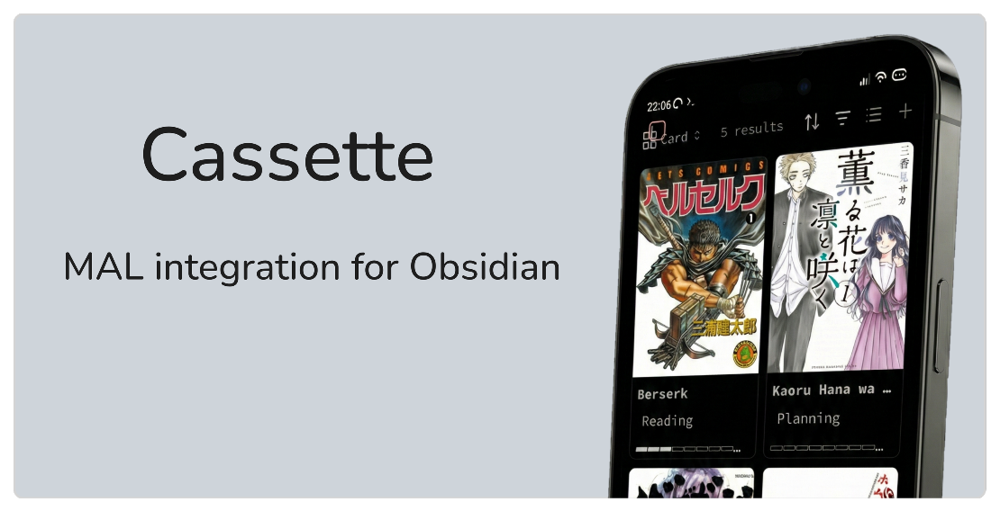

Cassette is an Obsidian plugin that syncs your anime and manga lists from MyAnimeList into structured Markdown notes, complete with metadata, cover image, and automatic updates.

### Get started

To authenticate with the MAL API, you’ll need to create your own application. You can follow the steps in this guide [MAL Authentication](https://github.com/zara-kasi/cassette/blob/main/docs/mal-authentication-guide.md)

After authenticating, use the Command Palette and run `Cassette: Sync all from MyAnimeList` or use the ribbon icon (Cassette symbol). Synced anime and manga appear in your chosen folder.

### Contributing

If you'd like to help improve this plugin, see [CONTRIBUTING.md](./CONTRIBUTING.md) for development instructions. You can also report bugs or suggest new features in the [Issues](https://github.com/zara-kasi/cassette/issues) section.

For details on data handling, privacy, and compliance with MyAnimeList’s API terms, see the 
[Privacy, Data Use & API Compliance Policy](./PRIVACY_COMPLIANCE.md).

License: [MIT License](./LICENSE)
