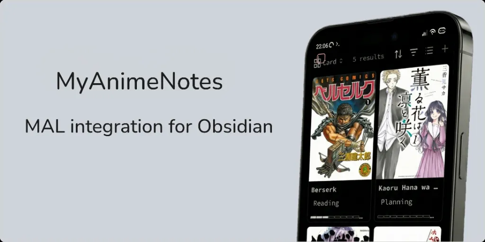

MyAnimeNotes is an [Obsidian](https://obsidian.md/) plugin that syncs your anime and manga lists from [MyAnimeList](https://myanimelist.net/) into structured Markdown notes, complete with metadata, cover image, and automatic updates.

### Get started

1. Open **Settings** > **MyAnimeNotes**.
2. Click **Login** to authenticate immediately via the browser.
3. Once logged in, use the **Command Palette** and run `MyAnimeNotes: Sync all from myanimelist` or click the **ribbon icon** ( <svg xmlns="http://www.w3.org/2000/svg" width="24" height="24" viewBox="0 0 24 24" fill="none" stroke="currentColor" stroke-width="2" stroke-linecap="round" stroke-linejoin="round" class="lucide lucide-origami-icon lucide-origami"><path d="M12 12V4a1 1 0 0 1 1-1h6.297a1 1 0 0 1 .651 1.759l-4.696 4.025"/><path d="m12 21-7.414-7.414A2 2 0 0 1 4 12.172V6.415a1.002 1.002 0 0 1 1.707-.707L20 20.009"/><path d="m12.214 3.381 8.414 14.966a1 1 0 0 1-.167 1.199l-1.168 1.163a1 1 0 0 1-.706.291H6.351a1 1 0 0 1-.625-.219L3.25 18.8a1 1 0 0 1 .631-1.781l4.165.027"/></svg> origami).

### Features

-   Runs entirely on your device with no external servers or services. All data is stored locally in your Obsidian vault.

> [!warning]
> Your app credentials (access token and refresh tokens) are saved locally in the plugin's `data.json`.

-   Powerful template engine supporting 40+ variables for both anime and manga.

-   30+ filters including wikilink, date formatting, join, blockquote, callout, mathematical operations, and more.

> [!note]
> The template feature is modeled after [Obsidian Web Clipper](https://github.com/obsidianmd/obsidian-web-clipper), with some small additions like an auto-complete menu for variables and filters.

-   Extracts extensive data including titles, genres, studios, broadcast times, user scores, progress tracking, and more.

-   Offers flexible sync options including sync all, sync anime only, sync manga only, and sync active statuses (currently watching/reading).

-   **Auto-Sync Capabilities**:
    -   Sync on startup option (starts sync 2 mins after Obsidian launches).
    -   Scheduled sync at regular intervals (minimum 60 minutes).
    -   Efficient auto-sync mode to reduce API requests by only syncing watching/reading items.

> [!warning]
> The MAL API does not have an endpoint or parameter to sync only the latest changes (delta sync). Due to this limitation, we must fetch all items every time we use sync. That's why limiting the auto-sync to only fetch active list status ensures we aren't abusing their API requests.

-   Secure authentication using OAuth 2.0 [PKCE](https://oauth.net/2/pkce/) flow for the official [MAL API](https://myanimelist.net/apiconfig).

> [!note]
> There are two ways to authenticate MyAnimeNotes with MAL:
>
> 1. Default: Use the public OAuth. The plugin will use the Client ID provided by the developer to authenticate.
> 2. Custom: If you prefer to use your own API credentials, you can enable "Custom App" in settings and enter your own Client ID. To get your own Client ID, you’ll need to create your own application on MAL. [You can follow the steps in this guide](https://github.com/zara-kasi/obsidian-myanimenotes/blob/main/docs/mal-authentication-guide.md).

-   Builds index on-demand for O(1) lookups while avoiding stale data issues.

-   Lock manager prevents race conditions when multiple operations target the same file.

> [!note]
> The plugin builds an index for files with the `myanimenotes` property. The scope of the index is the entire vault.
> You can move the files it creates anywhere in the vault, and the plugin will still be able to update them.

-   Skips unchanged items during sync to improve performance, with an option to force a full sync.

> [!note]
> If you want to update all files, not just the ones that changed, you can turn on the "Ignore Timestamp" toggle. However, turning this on will create unnecessary changes. It could become a problem if you use a sync service like the Git plugin.

### Documentation

-   **[Privacy Policy](./PRIVACY.md)**: Explains how your data is handled locally.
-   **[API Compliance](./COMPLIANCE.md)**: Details our adherence to the MyAnimeList Developer Agreement.
-   **[Contributing](./CONTRIBUTING.md)**: Guidelines for setting up the development environment and submitting PRs.

> [!note]
> The source code is extensively self-documented. For a broader understanding of the plugin's architecture, you can also see the third-party documentation.

### Attribution

All anime and manga data are sourced from [MyAnimeList.net](https://myanimelist.net).
**MyAnimeNotes** is an independent project and is **not affiliated with MyAnimeList Co., Ltd.**

### License

This project is licensed under the [MIT License](./LICENSE).
