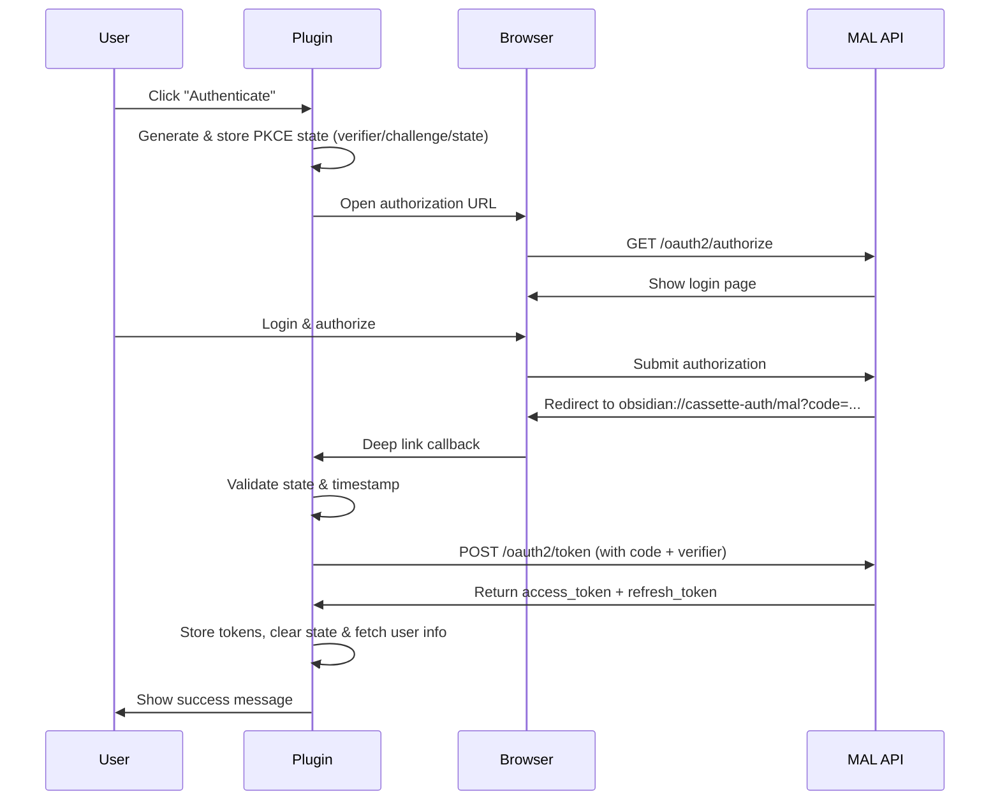

# OAuth 2.0 Authentication Flow for MyAnimeList in Obsidian

## Flow Overview



## Contributor Setup

### Prerequisites

To test or modify the authentication flow, you'll need:

1. **MAL Developer Application:** Register your own test application on MyAnimeList to obtain a `client_id` (and optionally `client_secret`).
    
    - Follow the guide: [[Get Client ID & Client Secret from MyAnimeList]]
    - **Critical:** Use the exact redirect URI: `obsidian://cassette-auth/mal`
2. **Test Credentials:** Store your test credentials in the plugin settings UI (or configure them programmatically if building dev tooling).
    
3. **Network Inspector:** A tool like [mitmproxy](https://mitmproxy.org/) or browser DevTools can help debug OAuth redirects and token exchanges.
    

### Testing Checklist

Before committing auth changes:

- ✅ Fresh authentication flow (new user)
- ✅ Token expiry and automatic refresh
- ✅ App restart mid-authentication (state persistence)
- ✅ Invalid/expired authorization codes
- ✅ State mismatch scenarios (tamper with state parameter)
- ✅ Network failures during token exchange
- ✅ Logout and re-authentication

## Architecture

### File Structure

```
src/api/mal/auth/
├── index.ts           # Public API exports
├── oauth-flow.ts      # Core OAuth flow logic
├── pkce.ts           # PKCE security utilities
├── token-manager.ts   # Token validation & refresh
├── user-service.ts    # User info fetching
├── logout.ts         # Session cleanup
├── constants.ts      # API endpoints & config
└── types.ts          # TypeScript interfaces
```

_All paths are relative to project root._

## Core Authentication Flow

### 1. Initiating Authentication (`startAuthFlow`)

**File:** `src/api/mal/auth/oauth-flow.ts`

```typescript
// Generate security parameters
const verifier = generateVerifier();      // Random 32-byte string
const challenge = generateChallenge(verifier);  // Same as verifier for 'plain'
const state = generateState();            // UUID for CSRF protection

// Store for callback validation
plugin.settings.malAuthState = {
  verifier,
  state,
  timestamp: Date.now()
};
await plugin.saveSettings();
```

**Why persist in settings?**

- Obsidian's plugin settings survive app restarts and context switches
- The verifier must be available when the callback arrives (potentially minutes later)
- Unlike web apps, we can't use session storage (different context than browser)

**PKCE 'plain' method:** MAL requires `code_challenge_method: 'plain'`, meaning the challenge equals the verifier. While less secure than S256 (SHA-256 hashing), it's MAL's specification and still prevents code interception.

### 2. Authorization URL Construction

```typescript
const params = new URLSearchParams({
  response_type: 'code',
  client_id: plugin.settings.malClientId,
  redirect_uri: REDIRECT_URI,  // 'obsidian://cassette-auth/mal'
  code_challenge: challenge,
  code_challenge_method: 'plain',
  state: state
});

const authUrl = `${MAL_AUTH_URL}?${params.toString()}`;
```

**Custom URI scheme:** The `obsidian://` protocol is registered by Obsidian to handle deep links. When MAL redirects to this URI, Obsidian intercepts it and triggers the plugin's URI handler.

**Getting your Client ID:** See [[Get Client ID & Client Secret from MyAnimeList]] for instructions on registering your application and obtaining credentials.

### 3. Handling the OAuth Callback (`handleOAuthRedirect`)

**File:** `src/api/mal/auth/oauth-flow.ts`

#### State Validation

```typescript
// Retrieve stored auth state from settings
const authState = plugin.settings.malAuthState;

// Check expiry (10-minute timeout)
const stateAge = Date.now() - authState.timestamp;
if (stateAge > AUTH_STATE_TIMEOUT_MS) {
  plugin.settings.malAuthState = null;  // Clean up expired state
  throw new Error('Authentication session expired');
}

// Validate state parameter (CSRF protection)
if (state !== authState.state) {
  throw new Error('State mismatch - possible CSRF attack');
}
```

**Why timeout?**

- Limits the window for replay attacks
- Prevents stale auth states from accumulating
- 10 minutes balances security with user experience (slow users still complete flow)

#### Parameter Extraction

**File:** `src/api/mal/auth/oauth-flow.ts`

```typescript
function extractOAuthParams(params: OAuthParams): { code: string | null; state: string | null } {
  // Handle object format: { code: 'abc', state: 'xyz' }
  if (params.code) {
    return { code: params.code, state: params.state || null };
  }
  
  // Handle query string: '?code=abc&state=xyz'
  if (typeof params === 'string') {
    const urlParams = new URLSearchParams(
      params.startsWith('?') ? params.slice(1) : params
    );
    return {
      code: urlParams.get('code'),
      state: urlParams.get('state')
    };
  }
  
  // Handle URL object: { url: 'obsidian://...?code=abc' }
  if (params.url) {
    const url = new URL(params.url);
    return {
      code: url.searchParams.get('code'),
      state: url.searchParams.get('state')
    };
  }
  
  return { code: null, state: null };
}
```

**Why multiple formats?** Obsidian's URI handler behavior varies across platforms (Windows, macOS, Linux) and Obsidian versions. This defensive parsing ensures compatibility.

### 4. Token Exchange

**File:** `src/api/mal/auth/oauth-flow.ts`

```typescript
const body = new URLSearchParams({
  client_id: plugin.settings.malClientId,
  code: code,                          // Authorization code from callback
  code_verifier: verifier,             // PKCE proof
  grant_type: 'authorization_code',
  redirect_uri: REDIRECT_URI
});

// Client secret is optional for public clients
if (plugin.settings.malClientSecret?.trim()) {
  body.append('client_secret', plugin.settings.malClientSecret.trim());
}
```

**Public vs Confidential Clients:**

- **Public clients** (mobile/desktop apps): Can't securely store secrets → use PKCE
- **Confidential clients** (server apps): Can store secrets → use client_secret
- MAL supports both; we default to public client (PKCE only) but allow optional secret

**Token storage:**

```typescript
plugin.settings.malAccessToken = data.access_token;
plugin.settings.malRefreshToken = data.refresh_token;
plugin.settings.malTokenExpiry = Date.now() + (data.expires_in * 1000);
plugin.settings.malAuthenticated = true;

// Clear auth state - no longer needed
plugin.settings.malAuthState = null;
```

Tokens are stored in encrypted plugin settings (Obsidian handles encryption). The auth state is cleared to prevent reuse.

## Token Management

**File:** `src/api/mal/auth/token-manager.ts`

### Token Validation

```typescript
export function isTokenValid(plugin: CassettePlugin): boolean {
  return !!(
    plugin.settings.malAccessToken && 
    plugin.settings.malTokenExpiry && 
    Date.now() < (plugin.settings.malTokenExpiry - TOKEN_EXPIRY_BUFFER)
  );
}
```

**5-minute buffer (`TOKEN_EXPIRY_BUFFER`):** Prevents race conditions where a token expires mid-request. We refresh proactively before expiry.

### Automatic Token Refresh

```typescript
export async function ensureValidToken(plugin: CassettePlugin): Promise<void> {
  if (!isTokenValid(plugin)) {
    if (!plugin.settings.malRefreshToken) {
      throw new Error('Token expired and no refresh token available');
    }
    
    await refreshAccessToken(plugin);  // Refresh using refresh_token grant
  }
}
```

Called before every API request. If the access token is expired/expiring, automatically refreshes it using the refresh token. This is transparent to the user—no re-authentication needed.

**Refresh flow:**

```typescript
const body = new URLSearchParams({
  client_id: plugin.settings.malClientId,
  refresh_token: plugin.settings.malRefreshToken,
  grant_type: 'refresh_token'
});
```

Returns a new access token (and sometimes a new refresh token). Updates stored tokens and expiry time.

## Security Considerations

### Three-Layer Defense

1. **PKCE (Code Interception Prevention)**
    
    - Even if an attacker intercepts the authorization code, they can't exchange it without the verifier
    - The verifier is generated client-side and never transmitted until token exchange
2. **State Parameter (CSRF Prevention)**
    
    - Ensures the callback corresponds to a user-initiated auth flow
    - Prevents malicious sites from tricking users into authorizing their app
3. **Session Expiry (Replay Attack Mitigation)**
    
    - 10-minute timeout limits the window for stale auth states
    - Expired states are automatically cleaned up

### PKCE Implementation Details

**File:** `src/api/mal/auth/pkce.ts`

```typescript
export function generateVerifier(): string {
  if (typeof crypto === 'undefined' || !crypto.getRandomValues) {
    throw new Error('Crypto API unavailable');
  }
  
  const arr = new Uint8Array(32);  // 32 bytes = 256 bits of entropy
  crypto.getRandomValues(arr);
  return base64UrlEncode(arr);     // URL-safe base64, max 128 chars per MAL spec
}
```

**Why crypto API:**

- Uses OS-level cryptographically secure random number generator
- Essential for security-critical parameters
- Always available in Electron (Obsidian's runtime)

**Base64 URL encoding:**

```typescript
function base64UrlEncode(arr: Uint8Array): string {
  // Safe to use btoa here as input is a byte array, not arbitrary user strings
  return btoa(String.fromCharCode(...arr))
    .replace(/\+/g, '-')   // + → -
    .replace(/\//g, '_')   // / → _
    .replace(/=/g, '')     // Remove padding
    .substring(0, 128);    // MAL's 128-char limit
}
```

Converts binary data to URL-safe characters per RFC 7636. The `btoa` function is safe here because we're encoding a byte array, not arbitrary Unicode strings (which could cause encoding issues).

### State Generation

```typescript
export function generateState(): string {
  // Prefer crypto.randomUUID() (most efficient)
  if (crypto.randomUUID) {
    return crypto.randomUUID();  // e.g., '123e4567-e89b-12d3-a456-426614174000'
  }
  
  // Fallback: 16 bytes → 32 hex chars
  const arr = new Uint8Array(16);
  crypto.getRandomValues(arr);
  return Array.from(arr, byte => byte.toString(16).padStart(2, '0')).join('');
}
```

Either approach provides sufficient entropy for CSRF protection.

## Error Handling

### User-Friendly Error Messages

**File:** `src/api/mal/auth/oauth-flow.ts`

```typescript
function formatTokenError(res: any): string {
  let errorMsg = `Token exchange failed (HTTP ${res.status})`;
  
  const errorData = res.json || JSON.parse(res.text);
  
  if (errorData.error === 'invalid_client') {
    errorMsg += '\n\nTip: Check your Client ID and Secret in settings.';
  } else if (errorData.error === 'invalid_grant') {
    errorMsg += '\n\nTip: The authorization code may have expired. Try again.';
  }
  
  return errorMsg;
}
```

Translates MAL's OAuth error codes into actionable user guidance without exposing technical implementation details.

### Common Error Scenarios

|Error|Cause|Solution|
|---|---|---|
|`invalid_client`|Wrong Client ID/Secret|Verify credentials match your [[Get Client ID & Client Secret from MyAnimeList\|MAL app registration]]|
|`invalid_grant`|Code expired/reused|Authorization codes are single-use; restart flow|
|`State mismatch`|CSRF attack or timing issue|Restart authentication|
|`Session expired`|>10 minutes since initiation|Restart authentication|
|`invalid_redirect_uri`|Redirect URI mismatch|Ensure your MAL app uses exactly `obsidian://cassette-auth/mal`|

## Integration Points

### Plugin Settings Schema

Required settings for authentication:

```typescript
interface PluginSettings {
  malClientId: string;           // MAL app Client ID
  malClientSecret?: string;      // Optional for confidential clients
  malAccessToken: string;        // Current access token
  malRefreshToken: string;       // For automatic renewal
  malTokenExpiry: number | null; // Unix timestamp (ms)
  malAuthenticated: boolean;     // Auth status flag
  malUserInfo: MALUserInfo | null;
  malAuthState: MALAuthState | null;  // Temporary PKCE state
}
```

### URI Handler Registration

In `main.ts`:

```typescript
this.registerObsidianProtocolHandler('cassette-auth', async (params) => {
  if (params.action === 'mal') {
    await handleOAuthRedirect(this, params);
  }
});
```

Obsidian calls this when `obsidian://cassette-auth/mal?code=...` is opened.

## Usage Example

**File:** `src/api/mal/auth/index.ts` (barrel export)

```typescript
// Import from the auth module's index.ts barrel file
import { 
  startAuthFlow, 
  isAuthenticated, 
  ensureValidToken,
  getAuthHeaders,
  logout 
} from 'src/api/mal/auth';

// Initiate login
await startAuthFlow(plugin);

// Check auth status
if (isAuthenticated(plugin)) {
  // Make API calls
  await ensureValidToken(plugin);  // Auto-refresh if needed
  const headers = getAuthHeaders(plugin);
  // ... make request with headers
}

// Logout
await logout(plugin);  // Clears all tokens and auth data
```

**Implementation files:**

- Logout: `src/api/mal/auth/logout.ts`
- User info: `src/api/mal/auth/user-service.ts`

## Debugging Tips

### Enable Debug Logging

The codebase uses `createDebugLogger` for conditional logging:

```typescript
const debug = createDebugLogger(plugin, 'MAL Auth');
debug.log('[MAL Auth] Received OAuth redirect:', params);
```

Enable debug mode in plugin settings to see detailed auth flow logs.

### Common Issues

**"No auth state found" error:**

- Auth state was cleared or expired
- Solution: Restart authentication from the beginning

**"State mismatch" error:**

- State parameter was tampered with or lost
- Solution: Clear browser cache and restart authentication

**Token exchange fails silently:**

- Check network logs for `POST /oauth2/token` response
- Verify Client ID matches your MAL application
- Ensure redirect URI is exactly `obsidian://cassette-auth/mal`

**App doesn't receive callback:**

- Obsidian URI handler may not be registered
- Try restarting Obsidian
- On Linux, check `.desktop` file associations

## References

- [RFC 6749 (OAuth 2.0)](https://datatracker.ietf.org/doc/html/rfc6749)
- [RFC 7636 (PKCE)](https://datatracker.ietf.org/doc/html/rfc7636)
- [MAL API Documentation](https://myanimelist.net/apiconfig/references/api/v2)
- [[Get Client ID & Client Secret from MyAnimeList|MAL Application Setup Guide]]

---