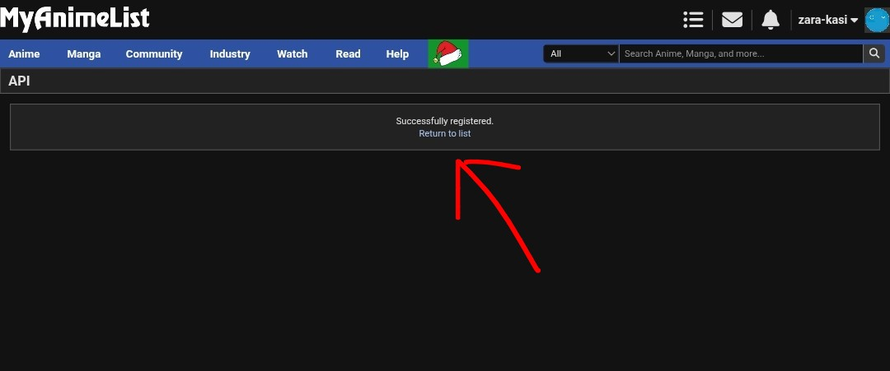
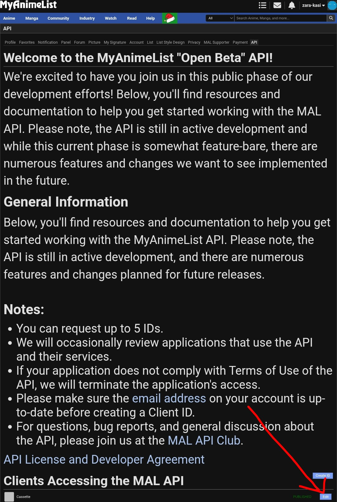
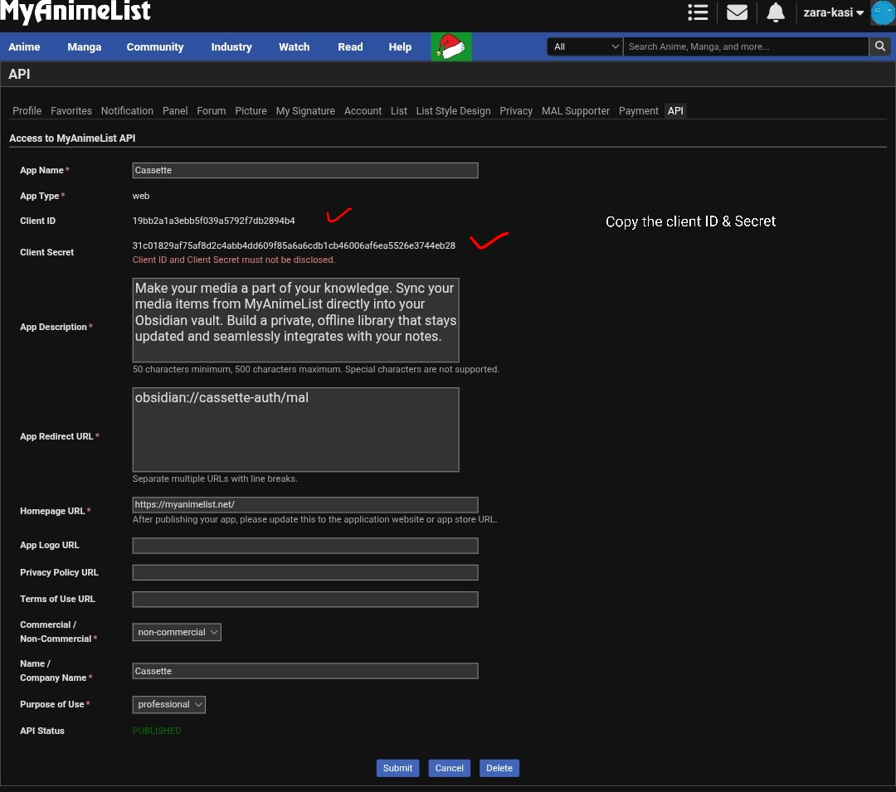
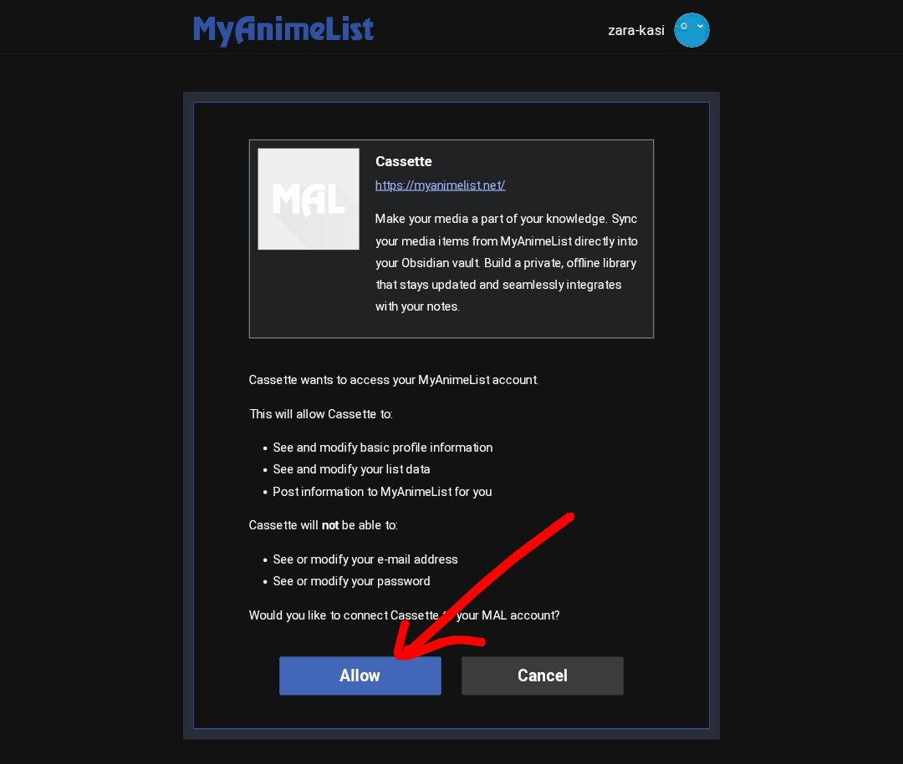
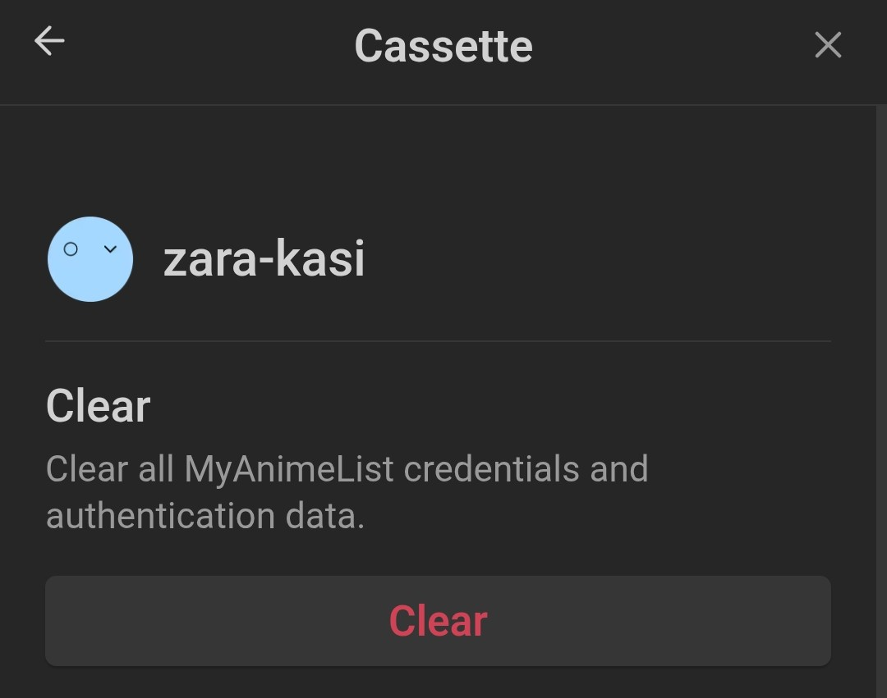

# Get Client ID & Client Secret from MyAnimeList

---

1. Go to [myanimelist.net/apiconfig/create](https://myanimelist.net/apiconfig/create)
2. Fill in the following details:  

| Field                | Value                                                                                                                                                                                                                                   |
| -------------------- | --------------------------------------------------------------------------------------------------------------------------------------------------------------------------------------------------------------------------------------- |
| **App Name**         | MyAnimeNotes                                                                                                                                                                                                                                |
| **Description**      | Sync your media items from MyAnimeList directly into your Obsidian vault. Build a private, offline library that stays updated and seamlessly integrates with your notes. |
| **App Redirect URI** | obsidian://myanimenotes-auth/mal                                                                                                                                                                                                            |
| **Homepage URL**     | https://myanimelist.net/                                                                                                                                                                                                                |
| **Company Name**     | MyAnimeNotes                                                                                                                                                                                                          |

> ⚠️ The Redirect URI must be exactly `obsidian://myanimenotes-auth/mal`, or authentication will fail.

3. Click **Save** and copy your **Client ID** and **Client Secret**.  
4. Open Obsidian **Settings** → **MyAnimeNotes**
5. Enter your **Client ID** and **Client Secret**
6. Click **Authenticate** and sign in via your browser

# Screenshots

1. Fill the application details

2. Go to API page

3. Click Edit to view you application client id & secret

4. Copy both Client ID & Client Secret. ( Make sure to save them somewhere safe )

5. Fill Client ID & Secret and click on Authenticate

6. Click Allow and it will redirect you to Obsidian

7. Done 👍 

