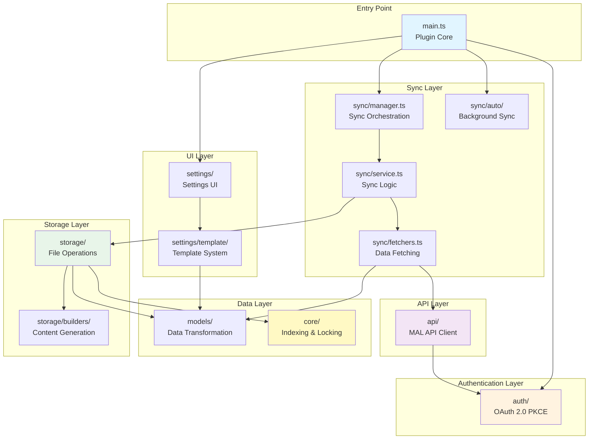
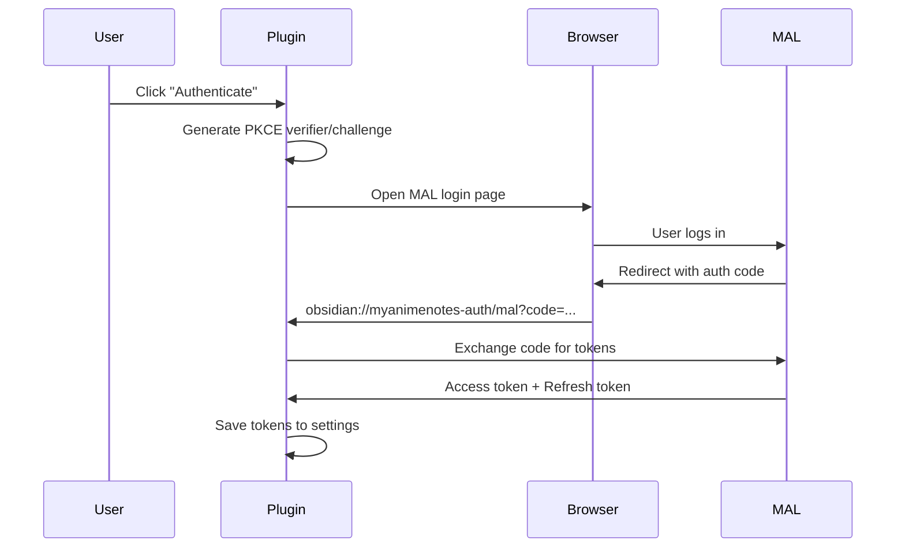
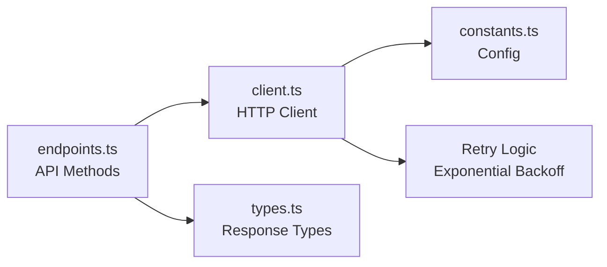
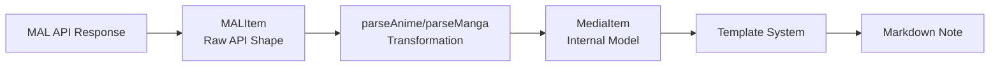
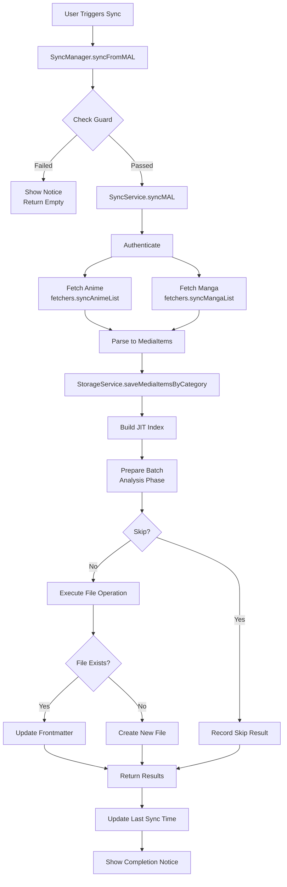
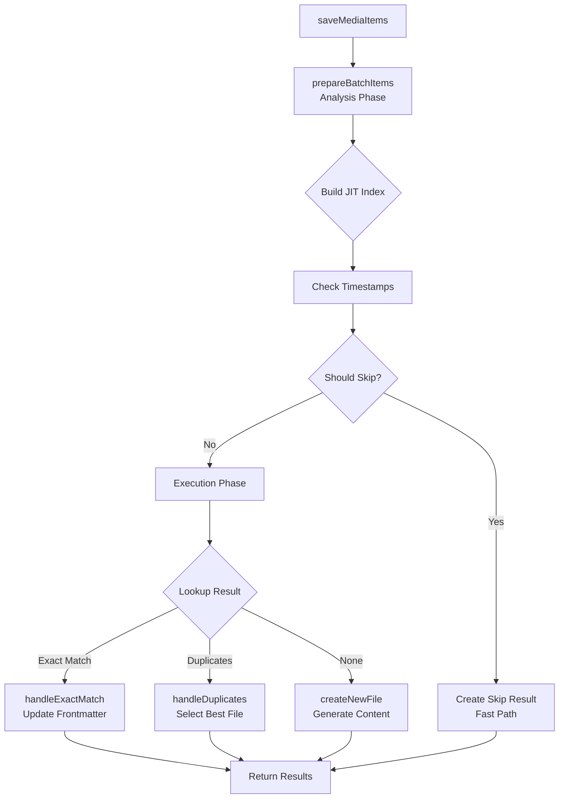
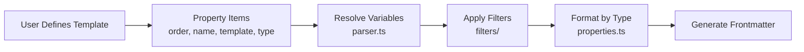
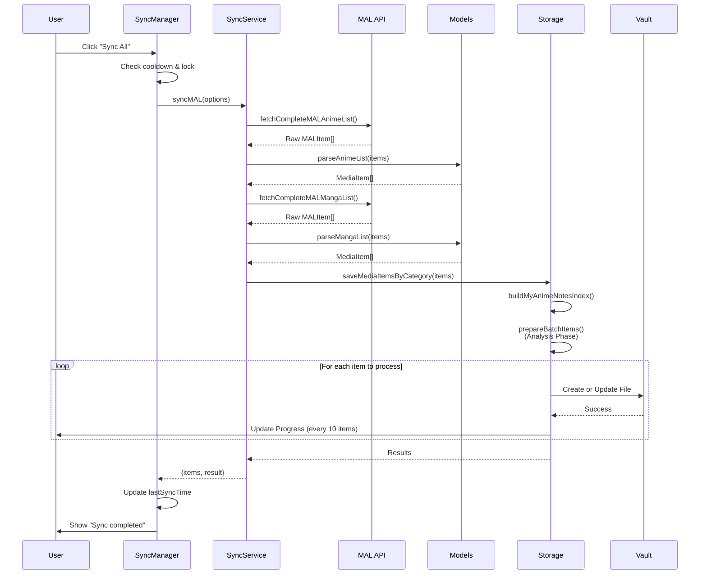
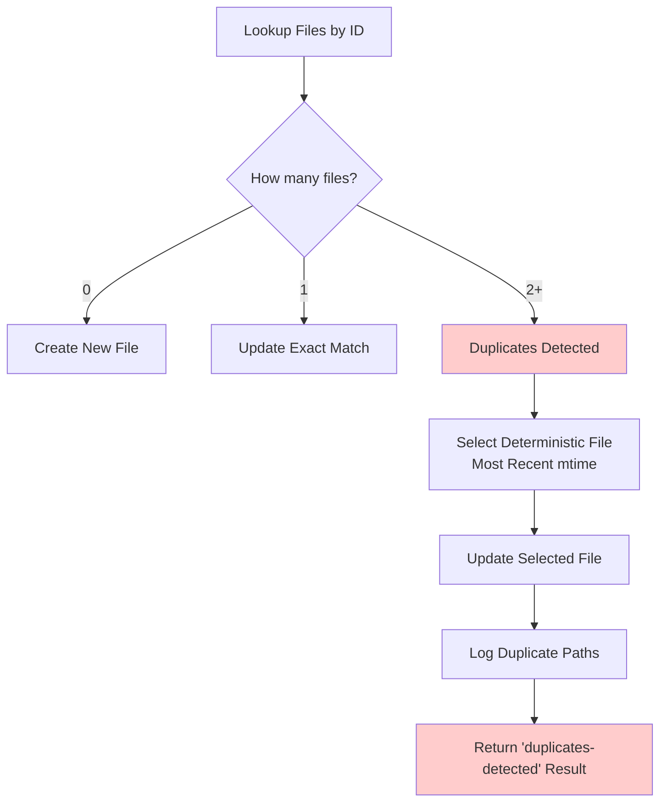

# MyAnimeNotes Plugin - Developer Documentation

## Overview

MyAnimeNotes is an Obsidian plugin that synchronizes your anime and manga lists from MyAnimeList (MAL) into structured Markdown notes. The plugin handles OAuth authentication, real-time syncing, template-based note generation, and intelligent file management with duplicate detection and concurrency control.

## Architecture Overview



## Core Concepts

### 1. **MyAnimeNotes Sync Identifier**
Every media item has a unique identifier: `provider:category:id` (e.g., `mal:anime:1234`). This identifier is stored in the note's frontmatter and serves as the source of truth for linking notes to MAL entries.

### 2. **JIT (Just-In-Time) Indexing**
Instead of maintaining a persistent database, the plugin builds an in-memory index on-demand by scanning Obsidian's MetadataCache. This provides O(1) lookups while avoiding stale data issues.

### 3. **Lock Manager**
A concurrency control system that prevents race conditions when multiple operations target the same file simultaneously.

### 4. **Template System**
A flexible, user-customizable template engine that supports variables, filters, and property type formatting.

## Module Breakdown

### 📁 `src/main.ts` - Plugin Entry Point

**Purpose**: Lifecycle management and initialization

**Key Responsibilities**:
- Plugin loading/unloading
- Manager initialization (Sync, AutoSync, Lock)
- Command registration
- OAuth protocol handler registration

**Important Classes**:
- `MyAnimeNotesPlugin` - Main plugin class extending Obsidian's Plugin

```typescript
// Initialization flow
onload() → 
  loadSettings() → 
  createManagers() → 
  registerHandlers() → 
  addCommands()
```

---

### 📁 `src/auth/` - Authentication Layer

**Purpose**: OAuth 2.0 PKCE flow implementation for MAL API



**Key Files**:

| File | Purpose |
|------|---------|
| `oauth-flow.ts` | Manages the OAuth authorization flow |
| `pkce.ts` | Generates PKCE cryptographic parameters |
| `token-manager.ts` | Token validation, refresh, and expiry handling |
| `user-service.ts` | Fetches and stores user profile information |
| `logout.ts` | Clears authentication data |

**Critical Functions**:
```typescript
// Start OAuth flow
startAuthFlow(plugin) 
  → generateVerifier() 
  → openBrowser(authUrl)

// Handle redirect
handleOAuthRedirect(plugin, params) 
  → validateState() 
  → exchangeCodeForToken()

// Ensure valid token before API calls
ensureValidToken(plugin) 
  → isTokenValid() 
  → refreshAccessToken() (if expired)
```

---

### 📁 `src/api/` - MAL API Client

**Purpose**: HTTP communication with MyAnimeList API v2

**Architecture**:


**Key Features**:
- **Rate Limiting**: Automatic retry with exponential backoff for 429/5xx errors
- **Pagination**: Auto-fetches all pages for complete lists
- **Field Optimization**: Requests only necessary fields to reduce payload
- **Throttling**: Batches concurrent requests to avoid overwhelming the API

**Example Flow**:
```typescript
// Complete list fetch with pagination
fetchCompleteMALAnimeList(plugin) {
  let offset = 0;
  const allItems = [];
  
  do {
    const response = await makeMALRequest(plugin, endpoint, { offset, limit: 100 });
    allItems.push(...response.data);
    offset += 100;
  } while (response.paging?.next);
  
  return allItems;
}
```

---

### 📁 `src/models/` - Data Models

**Purpose**: Transform raw MAL API data into internal representations

**Files**:
- `types.ts` - TypeScript interfaces (MediaItem, MALItem, etc.)
- `mappers.ts` - Pure functions for data transformation
- `media.ts` - Orchestrates parsing logic

**Transformation Pipeline**:


**Key Normalizations**:
- **Status Mapping**: "currently_airing" → "Ongoing"
- **Alternative Titles**: Flattens nested structure into array
- **Genres**: Extracts clean genre names
- **Dates**: Standardizes to YYYY-MM-DD format

---

### 📁 `src/core/` - Core Utilities

**Purpose**: Fundamental sync infrastructure

#### `identifiers.ts` - ID Management
```typescript
// Generate identifier
generateMyAnimeNotesSync(item) → "mal:anime:1234"

// Validate format
validateMyAnimeNotesSyncFormat(id) → boolean

// Find files by ID
findFilesByMyAnimeNotesSync(index, id) → TFile[]
```

#### `indexing.ts` - JIT Index
```typescript
// Build snapshot of vault state
buildMyAnimeNotesIndex(plugin) {
  const index = new Map<string, TFile[]>();
  
  for (const file of vault.getMarkdownFiles()) {
    const cache = metadataCache.getFileCache(file);
    const id = cache?.frontmatter?.myanimenotes;
    
    if (id) index.set(id, [...(index.get(id) || []), file]);
  }
  
  return index; // O(1) lookups
}
```

**Performance**:
- Scans entire vault in ~50-200ms for typical vaults
- No disk I/O (uses MetadataCache)
- Detects duplicates automatically

#### `lock.ts` - Concurrency Control
```typescript
// Acquire lock (waits if locked)
await lockManager.acquireSyncLock("mal:anime:1234");

// Execute critical section
try {
  await updateFile();
} finally {
  lockManager.releaseSyncLock("mal:anime:1234");
}

// Or use HOF pattern
await lockManager.withLock("mal:anime:1234", async () => {
  await updateFile();
});
```

**Features**:
- Per-ID locking (fine-grained concurrency)
- Stale lock detection (30s timeout)
- Automatic cleanup on plugin unload

---

### 📁 `src/sync/` - Synchronization Engine

**Purpose**: Orchestrates the sync process from API → Storage



#### `manager.ts` - Sync Orchestration
**Responsibilities**:
- Enforces cooldown period (5 minutes)
- Prevents concurrent syncs (lock flag)
- Provides convenience wrappers (syncAnime, syncManga, syncActiveStatuses)
- Tracks last sync timestamp

#### `service.ts` - Sync Logic
**Responsibilities**:
- Validates authentication
- Executes fetch operations
- Aggregates results from multiple sources
- Handles partial failures gracefully

#### `fetchers.ts` - Data Retrieval
```typescript
// Status-based sync (optimized)
syncAnimeList(plugin, ["watching", "plan_to_watch"]) {
  const promises = statuses.map(status => 
    fetchMALAnimeByStatus(plugin, status)
  );
  
  // Throttle to avoid rate limits
  const results = await throttlePromises(promises, 2, 300);
  return results.flat();
}
```

#### `auto/manager.ts` - Background Sync
**Features**:
- **Sync on Load**: Delayed sync after Obsidian startup (2 minutes)
- **Scheduled Sync**: Recurring interval-based sync (minimum 60 minutes)
- **Smart Cooldown**: Prevents API spam during rapid restarts

---

### 📁 `src/storage/` - File System Layer

**Purpose**: Persist MediaItems as Markdown notes

**Architecture**:


#### **Two-Phase Processing Strategy**

**Phase 1: Analysis (Synchronous)**
```typescript
prepareBatchItems(plugin, items, config, folderPath, index) {
  const batchItems = [];
  
  for (const item of items) {
    const id = generateMyAnimeNotesSync(item);
    const lookup = lookupExistingFiles(index, id);
    
    // Get cached timestamp (no disk I/O!)
    const cache = metadataCache.getFileCache(lookup.files[0]);
    const cachedTimestamp = cache?.frontmatter?.synced;
    
    // Decide: skip or update?
    const shouldSkip = shouldSkipByTimestamp(
      cachedTimestamp, 
      item.updatedAt, 
      forceFullSync
    );
    
    batchItems.push({ item, id, lookup, shouldSkip });
  }
  
  return batchItems;
}
```

**Phase 2: Execution (Asynchronous)**
```typescript
// Fast-path optimization: Record skips immediately
const skipResults = createSkipResults(itemsToSkip);

// Process updates with UI yielding
for (let i = 0; i < itemsToProcess.length; i++) {
  const result = await executeOperation(batch);
  results.push(result);
  
  // Yield to UI every 10 items
  if (i % 10 === 0) await yieldToUI();
}
```

**Benefits**:
- Skipped items return instantly (no I/O)
- UI remains responsive during large syncs
- Efficient timestamp comparisons using cache

#### `builders/` - Content Generation

| File | Purpose |
|------|---------|
| `frontmatter.ts` | Builds properties object from template |
| `content.ts` | Generates complete file content (YAML + body) |
| `updater.ts` | Updates existing file frontmatter safely |
| `file.ts` | File utilities (folder creation, unique naming) |

**Key Flow**:
```typescript
// Generate frontmatter
const props = buildFrontmatterFromTemplate(item, template, id);

// Generate body content
const content = generateInitialFileContent(props, template.noteContent, item);

// Create file
await vault.create(filePath, content);
```

---

### 📁 `src/settings/` - Settings UI

**Purpose**: Configuration interface for users

#### `tab.ts` - Settings Tab
**Sections**:
1. **Authentication** - MAL login/logout
2. **Templates** - Anime/Manga note configuration
3. **Sync Options** - Intervals, auto-sync, force full sync
4. **Debug** - Logging and notifications

#### `template/` - Template System



**Template Variable Resolution**:
```typescript
// Input: "{{numEpisodes}} episodes watched: {{numEpisodesWatched}}"
// Item: { numEpisodes: 24, numEpisodesWatched: 12 }

resolveTemplate(template, item) {
  // Extract variables
  const vars = extractVariables(template); // ["numEpisodes", "numEpisodesWatched"]
  
  // Replace each variable
  let result = template;
  for (const { varName, filters } of vars) {
    let value = item[varName]; // 24, 12
    
    if (filters) {
      value = applyFilters(value, filters, item);
    }
    
    result = result.replace(`{{${varName}}}`, value);
  }
  
  return result; // "24 episodes watched: 12"
}
```

**Available Filters**:
- `wikilink` - Wraps in `[[...]]`
- `join` - Combines arrays with separator
- `date` - Formats dates (YYYY-MM-DD)
- `default` - Provides fallback for empty values
- `upper` / `lower` - Case transformation
- `split` - Splits strings into arrays

**Property Types**:
- `text` - Plain string
- `number` - Numeric value
- `date` - Date only (YYYY-MM-DD)
- `datetime` - Full ISO timestamp
- `checkbox` - Boolean
- `multitext` - Array of strings (list)

**UI Components**:
- Drag-and-drop reordering
- Variable autocomplete
- Type selector modal
- Folder suggestions

---

### 📁 `src/utils/` - Utilities

#### `logger.ts` - Logging System
```typescript
const log = new logger("SyncManager");

log.debug("Syncing items...");  // Only shows if debug mode enabled
log.error("Auth failed", error);  // Always visible
```

**Features**:
- Timestamped logs: `[12:34:56] [MyAnimeNotes] [Context] Message`
- Global debug toggle (syncs with settings)
- Context-based filtering

#### `notice.ts` - User Notifications
```typescript
showNotice("Sync completed", "success", 3000);
showNotice("Error occurred", "warning", 5000);
```

**Features**:
- Type-based styling (`mod-success`, `mod-warning`)
- Global enable/disable toggle
- Flexible argument overloading

---

## Data Flow Examples

### Complete Sync Flow



### Duplicate Resolution Flow



---

## Contributing Guidelines

### Setting Up Development Environment

```bash
# Clone the repository
git clone https://github.com/zara-kasi/obsidian-myanimenotes.git
cd obsidian-myanimenotes

# Install dependencies
npm install

# Start development build (watches for changes)
npm run dev

# Run linter
npm run lint

# Build for production
npm run build
```

### Code Style

- **TypeScript Strict Mode**: All types must be explicit
- **Pure Functions**: Prefer stateless functions where possible
- **Error Handling**: Always wrap API calls in try-catch
- **Logging**: Use `logger` class with appropriate context
- **Comments**: Document complex logic and public APIs

### Adding a New Feature

1. **Identify the Layer**: Determine which module owns the feature
2. **Define Types**: Add interfaces to `types.ts` files
3. **Implement Logic**: Write pure functions first, then integrate
4. **Update UI**: Add settings controls if needed
5. **Test**: Manually test with real MAL data
6. **Document**: Update this guide with new concepts

### Common Tasks

#### Adding a New Template Variable

1. **Update MediaItem** (`src/models/types.ts`):
```typescript
export interface MediaItem {
  // ...existing fields
  newField?: string;  // Add your field
}
```

2. **Update Parser** (`src/models/media.ts` or `mappers.ts`):
```typescript
export function parseAnime(plugin, malItem) {
  return {
    // ...existing mappings
    newField: malItem.node.new_api_field
  };
}
```

3. **Register in Metadata** (`src/settings/template/metadata.ts`):
```typescript
export const ANIME_PROPERTIES: PropertyMetadata[] = [
  // ...existing
  { key: "newField", label: "New Field", defaultName: "new_field" }
];
```

4. **Update Template Resolver** (`src/settings/template/parser.ts`):
```typescript
function resolvePropertyValue(item, variableName) {
  const valueMap = {
    // ...existing
    newField: item.newField
  };
  return valueMap[variableName];
}
```

#### Adding a New Template Filter

1. **Create Filter** (`src/settings/template/filters/myfilter.ts`):
```typescript
export function myFilter(value: unknown, param?: string): unknown {
  // Transform value
  return transformedValue;
}
```

2. **Register Filter** (`src/settings/template/filters/index.ts`):
```typescript
import { myFilter } from './myfilter';

const filterRegistry: Record<string, FilterFunction> = {
  // ...existing
  myFilter,
};
```

3. **Document Usage** (README or docs):
```markdown
## myFilter
Transforms value in [specific way].

**Usage**: `{{variable|myFilter:"param"}}`
```

---

## Performance Considerations

### Optimization Strategies

1. **JIT Indexing**: Build index only when needed, discard after use
2. **MetadataCache**: Leverage Obsidian's cache instead of reading files
3. **Batch Processing**: Process items in batches with UI yielding
4. **Fast-Path Skipping**: Return immediately for unchanged items
5. **Throttled Requests**: Limit API concurrency to avoid rate limits

### Memory Management

- Index is ephemeral (garbage collected after sync)
- Lock manager releases locks on plugin unload
- No persistent state beyond plugin settings

### Bottlenecks to Watch

- **Vault Scanning**: Large vaults (10k+ files) may slow index builds
- **API Pagination**: Complete list fetches can take 10-30 seconds
- **Concurrent Updates**: Too many parallel file writes can freeze UI

---

## Testing Strategies

### Manual Testing Checklist

- [ ] **Authentication**: Login, refresh token, logout
- [ ] **Sync**: Full sync, partial sync, active-only sync
- [ ] **Templates**: Variable resolution, filters, property types
- [ ] **Duplicates**: Create duplicates manually, verify selection logic
- [ ] **Concurrency**: Trigger multiple syncs rapidly
- [ ] **Auto-Sync**: Enable scheduled sync, restart Obsidian
- [ ] **Edge Cases**: Empty lists, network errors, invalid tokens

### Mock Data

Create test files manually:
```yaml
---
myanimenotes: mal:anime:1
synced: "2024-01-01T00:00:00Z"
title: Test Anime
---
```

Trigger syncs and verify behavior with different timestamps.

---

## Debugging Tips

### Enable Debug Mode
Settings → Debug Mode → Toggle ON

Logs will appear in Developer Console (Ctrl+Shift+I / Cmd+Opt+I):
```
[12:34:56] [MyAnimeNotes] [SyncManager] Starting sync...
[12:34:57] [MyAnimeNotes] [StorageService] Batch save: 150 items
[12:34:58] [MyAnimeNotes] [FileIndex] Index built: 150 identifiers (42ms)
```

### Common Issues

**"Not authenticated"**:
- Check `settings.malAuthenticated` and `settings.malAccessToken`
- Verify token expiry hasn't passed
- Re-authenticate via settings

**"Sync already in progress"**:
- Plugin detected overlapping sync
- Wait for current sync to complete or restart Obsidian

**"Duplicates detected"**:
- Multiple files have same `myanimenotes` ID
- Check file frontmatter manually
- Plugin will update the most recently modified file

**"Rate limit exceeded"**:
- Too many API requests in short time
- Plugin automatically retries with backoff
- Enable "Efficient auto-sync" to reduce load

---

## Future Enhancement Ideas

- **Incremental Sync**: Only fetch updated items using `updated_since` parameter
- **Conflict Resolution UI**: Let users choose which duplicate to keep
- **Template Variables**: Support nested objects (e.g., `{{studio.name}}`)
- **Custom Filters**: Allow users to write custom JavaScript filters
- **Sync Profiles**: Save different sync configurations (e.g., "Watching Only", "Completed Only")
- **Progress Modal**: Show live sync progress with item names
- **Webhook Support**: Trigger syncs when MAL list changes

---

## Additional Resources

- [Obsidian Plugin API Docs](https://docs.obsidian.md/Plugins/Getting+started/Build+a+plugin)
- [MyAnimeList API Docs](https://myanimelist.net/apiconfig/references/api/v2)
- [OAuth 2.0 PKCE Spec (RFC 7636)](https://datatracker.ietf.org/doc/html/rfc7636)
- [Plugin Repository](https://github.com/zara-kasi/obsidian-myanimenotes)
- [Issue Tracker](https://github.com/zara-kasi/obsidian-myanimenotes/issues)

---

## Contact & Support

For questions or contributions:
- **GitHub Issues**: Report bugs or request features
- **Pull Requests**: Submit code improvements
- **Discussions**: Ask questions or share ideas

---

**Happy Contributing! 🚀**