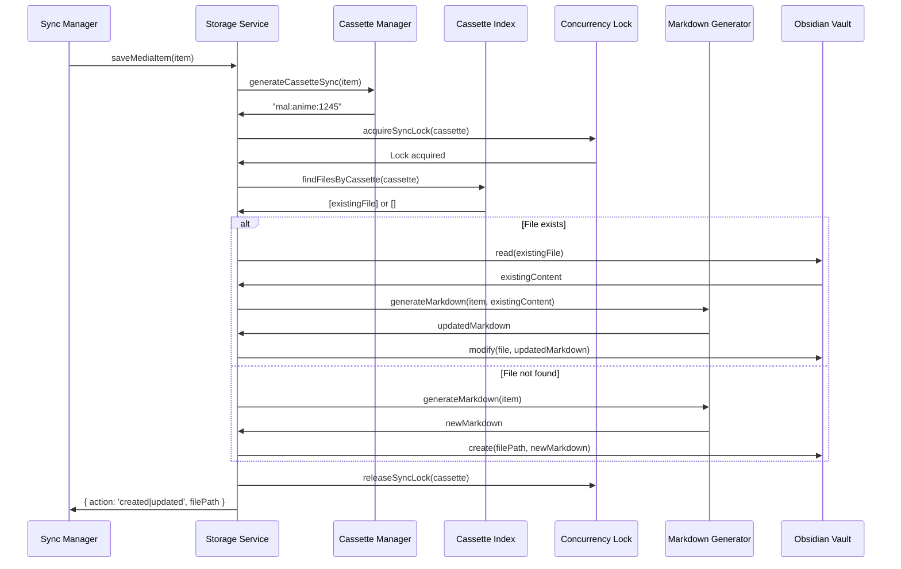

# Storage System Documentation for Cassette Plugin

## Overview

The Cassette plugin implements a sophisticated storage system that manages how media data from external APIs is persisted to your Obsidian vault. The storage system consists of four main components:

1. **Storage Service**: High-level API for saving media items to vault
2. **Cassette System**: Unique identifier management and file lookup with O(1) indexed search
3. **Markdown Generator**: Frontmatter and content generation with user content preservation
4. **File Utilities**: Sanitization, formatting, and filesystem operations



## Contributor Setup

### Prerequisites

1. **Understanding of Obsidian's Vault API**:
   - `vault.create()`, `vault.modify()`, `vault.read()`
   - `TFile` and `TFolder` abstractions
   - Frontmatter parsing via `MetadataCache`

2. **Testing Environment**:
   - Use a dedicated test vault (not your personal vault!)
   - Populate with test data: 10-20 anime/manga items
   - Test with both empty vault and pre-existing files

3. **Required Knowledge**:
   - YAML frontmatter format
   - Markdown file structure
   - Obsidian's wiki-link syntax `[[link]]`
   - File system path handling (cross-platform)

### Testing Checklist

Before committing storage changes:

- ✅ New file creation (empty vault)
- ✅ Existing file updates (preserve user content)
- ✅ Duplicate file detection and handling
- ✅ Legacy file migration (files without cassette)
- ✅ Concurrent saves (same item multiple times)
- ✅ Property mapping (default vs. custom)
- ✅ Special characters in titles (sanitization)
- ✅ Filename collisions (auto-numbering)
- ✅ Folder creation (missing folders)
- ✅ Cross-platform paths (Windows, Mac, Linux)
- ✅ Large batch saves (500+ items)
- ✅ Index rebuild (after vault changes)

## Architecture

### File Structure

```
src/storage/
├── index.ts                      # Public API exports
├── storage-service.ts            # High-level storage orchestration
├── file-utils.ts                 # File operations and sanitization
├── cassette/
│   ├── index.ts                  # Cassette module exports
│   ├── cassette-sync-manager.ts  # ID generation and file lookup
│   ├── cassette-lock.ts          # Concurrency control
│   └── cassette-index.ts         # In-memory file index (O(1) lookups)
└── markdown/
    ├── index.ts                  # Markdown module exports
    ├── frontmatter-builder.ts    # Frontmatter generation
    ├── markdown-generator.ts     # Complete markdown generation
    └── property-mapping.ts       # Custom property names
```

_All paths are relative to project root._

## Core Components

### 1. Storage Service

**File:** `src/storage/storage-service.ts`

The Storage Service is the high-level API that orchestrates the entire save process. It handles file lookup, concurrency control, content generation, and vault operations.

#### Storage Configuration

```typescript
export interface StorageConfig {
  animeFolder: string;           // e.g., "Cassette/Anime"
  mangaFolder: string;           // e.g., "Cassette/Manga"
  createFolders: boolean;        // Auto-create folders if missing
  propertyMapping?: PropertyMapping;  // Custom frontmatter field names
}
```

**Why separate folders?** Users organize media differently. Some prefer:
- Category separation: `Media/Anime/` vs `Media/Manga/`
- Flat structure: `Media/` (all items together)
- Year-based: `Media/2024/Anime/`

The plugin respects user preferences by allowing configurable paths.

#### Sync Action Result

```typescript
export interface SyncActionResult {
  action: 'created' | 'updated' | 'linked-legacy' | 'duplicates-detected' | 'skipped';
  filePath: string;              // Path to the saved file
  cassetteSync: string;          // Unique identifier (e.g., "mal:anime:1245")
  duplicatePaths?: string[];     // If duplicates found
  message?: string;              // Human-readable description
}
```

**Action types explained:**

- **`created`**: New file created (didn't exist before)
- **`updated`**: Existing file modified (content changed)
- **`linked-legacy`**: Pre-existing file without cassette identifier was migrated
- **`duplicates-detected`**: Multiple files with same cassette found (one updated)
- **`skipped`**: No changes needed (timestamp optimization)

#### Main Save Function

```typescript
export async function saveMediaItem(
  plugin: CassettePlugin,
  item: UniversalMediaItem,
  config: StorageConfig
): Promise<SyncActionResult>
```

**Process flow:**

1. **Generate Cassette Identifier**
   
   ```typescript
   const cassetteSync = generateCassetteSync(item);
   // Example: "mal:anime:1245"
   ```
   
   The cassette is the **primary key** for file lookup. Format: `provider:category:id`

2. **Acquire Concurrency Lock**
   
   ```typescript
   return await withLock(cassetteSync, async () => {
     // ... save logic
   });
   ```
   
   Prevents race conditions when multiple operations target the same item simultaneously (e.g., manual sync + auto-sync colliding).

3. **Determine Target Folder**
   
   ```typescript
   const folderPath = item.category === 'anime' 
     ? config.animeFolder 
     : config.mangaFolder;
   
   if (config.createFolders) {
     await ensureFolderExists(plugin, folderPath);
   }
   ```
   
   Auto-creates folders if missing. Fails gracefully if folder creation disabled.

4. **Lookup Existing Files**
   
   ```typescript
   const lookup = await lookupExistingFiles(plugin, cassetteSync, item, folderPath);
   ```
   
   Uses indexed search (O(1)) via `CassetteIndex`. Returns:
   - `exact`: Single file with matching cassette
   - `duplicates`: Multiple files with same cassette
   - `legacy`: Files without cassette but matching ID/name
   - `none`: No matching files found

5. **Handle Based on Lookup Result**
   
   ```typescript
   switch (lookup.type) {
     case 'exact':
       return handleExactMatch(...);     // Update existing file
     
     case 'duplicates':
       return handleDuplicates(...);     // Resolve and update one
     
     case 'legacy':
       return handleLegacyMigration(...); // Add cassette to old file
     
     case 'none':
       return createNewFile(...);        // Create new file
   }
   ```

**Why this multi-path approach?** Different scenarios require different handling:
- **Exact match**: Fast path, just update
- **Duplicates**: User created manual copies, pick most recent
- **Legacy**: Migrate old plugin data or user-created files
- **None**: Clean slate, create new

#### Timestamp Optimization

```typescript
function shouldSkipUpdate(
  localSynced: string | undefined,
  remoteSynced: string | undefined,
  forceSync: boolean
): boolean {
  if (forceSync) return false;  // Never skip if forced
  
  if (!localSynced || !remoteSynced) return false;  // Need both timestamps
  
  const localTime = new Date(localSynced).getTime();
  const remoteTime = new Date(remoteSynced).getTime();
  
  return localTime === remoteTime;  // Skip if timestamps match
}
```

**How it works:**
1. MAL API returns `updated_at` timestamp for each item
2. Plugin stores this in frontmatter as `synced: "2024-01-15T10:30:00Z"`
3. On next sync, compare timestamps
4. If equal, skip file write (no changes on MAL)

**Benefits:**
- Reduces disk I/O by 80%+ for subsequent syncs
- Preserves file modification times
- Faster sync completion

**Force sync override:** User setting `forceFullSync` bypasses this optimization, useful for:
- Recovering from corrupted files
- Applying property mapping changes
- Testing/debugging

#### Batch Save Operations

```typescript
export async function saveMediaItems(
  plugin: CassettePlugin,
  items: UniversalMediaItem[],
  config: StorageConfig
): Promise<SyncActionResult[]>
```

Saves multiple items sequentially with error isolation:

```typescript
const results: SyncActionResult[] = [];

for (const item of items) {
  try {
    const result = await saveMediaItem(plugin, item, config);
    results.push(result);
  } catch (error) {
    console.error(`Failed to save ${item.title}:`, error);
    // Continue with next item (don't fail entire batch)
  }
}

return results;
```

**Why sequential, not parallel?** 
- Obsidian's vault API is not fully thread-safe
- Concurrent writes can corrupt metadata cache
- Sequential is fast enough (1-2ms per file on SSD)

**Future optimization:** Could batch vault operations in groups of 10-20 for 5-10x speedup.

#### Category-Based Save

```typescript
export async function saveMediaItemsByCategory(
  plugin: CassettePlugin,
  items: UniversalMediaItem[],
  config: StorageConfig
): Promise<{ anime: string[]; manga: string[] }>
```

Groups items by category and returns saved paths:

```typescript
const animeItems = items.filter(item => item.category === 'anime');
const mangaItems = items.filter(item => item.category === 'manga');

const animeResults = await saveMediaItems(plugin, animeItems, config);
const mangaResults = await saveMediaItems(plugin, mangaItems, config);

return {
  anime: animeResults.map(r => r.filePath),
  manga: mangaResults.map(r => r.filePath)
};
```

**Use case:** Sync manager needs to report separate counts for anime vs manga.

### 2. Cassette System

**Files:** `src/storage/cassette/`

The Cassette System is the plugin's unique identifier mechanism. It provides:
- Deterministic ID generation
- Fast O(1) file lookups via indexing
- Concurrency control
- Legacy file detection

#### What is a Cassette?

A **cassette** is a unique identifier in the format:

```
provider:category:id
```

**Examples:**
- `mal:anime:1` (Cowboy Bebop on MyAnimeList)
- `mal:manga:2` (Berserk on MyAnimeList)
- `simkl:anime:123` (Future: Simkl support)

**Why this format?**
1. **Globally unique**: No collisions between providers or categories
2. **Human-readable**: Easy to debug and understand
3. **URL-safe**: No special characters that break filenames
4. **Extensible**: Easy to add new providers (AniList, Kitsu, etc.)

#### Cassette Generation

**File:** `src/storage/cassette/cassette-sync-manager.ts`

```typescript
export function generateCassetteSync(item: UniversalMediaItem): string {
  const provider = item.platform.toLowerCase();  // "mal"
  const category = item.category.toLowerCase();  // "anime"
  const id = String(item.id);                    // "1245"
  
  const cassetteSync = `${provider}:${category}:${id}`;
  
  // Validate format
  if (!validateCassetteSyncFormat(cassetteSync)) {
    throw new Error(`Invalid cassette format generated: ${cassetteSync}`);
  }
  
  return cassetteSync;
}
```

**Validation pattern:**

```typescript
export function validateCassetteSyncFormat(cassetteSync: string): boolean {
  const pattern = /^[a-z0-9_-]+:[a-z0-9_-]+:[A-Za-z0-9_-]+$/;
  return pattern.test(cassetteSync);
}
```

Ensures:
- Lowercase provider and category
- Alphanumeric with dashes/underscores only
- Three parts separated by colons

#### Cassette Index (O(1) Lookups)

**File:** `src/storage/cassette/cassette-index.ts`

The Cassette Index maintains an in-memory cache of `cassette → files` mappings for instant lookups.

**Data structures:**

```typescript
export class CassetteIndex {
  // Primary index: cassette -> files
  private cassetteToFiles: Map<string, Set<TFile>> = new Map();
  
  // Secondary index: file path -> cassette (reverse lookup)
  private fileToCassette: Map<string, string> = new Map();
  
  // Track last rebuild time
  private lastRebuildTime: number = 0;
  private isRebuilding: boolean = false;
}
```

**Why two indexes?**
1. **cassetteToFiles**: Fast lookup by cassette (primary use case)
2. **fileToCassette**: Fast reverse lookup when file changes (for index updates)

**Initialization:**

```typescript
async initialize(): Promise<void> {
  await this.rebuildIndex();
  this.registerMetadataListeners();
}
```

**Rebuild process:**

```typescript
async rebuildIndex(): Promise<void> {
  // Cooldown protection (5 seconds minimum between rebuilds)
  if (this.isRebuilding || (Date.now() - this.lastRebuildTime) < 5000) {
    return;
  }
  
  this.isRebuilding = true;
  const startTime = Date.now();
  
  // Clear existing indexes
  this.cassetteToFiles.clear();
  this.fileToCassette.clear();
  
  const { vault, metadataCache } = this.plugin.app;
  const allFiles = vault.getMarkdownFiles();
  
  // Build index from all files
  for (const file of allFiles) {
    const cache = metadataCache.getFileCache(file);
    const cassette = cache?.frontmatter?.cassette;
    
    if (cassette && typeof cassette === 'string') {
      // Add to cassette -> files mapping
      if (!this.cassetteToFiles.has(cassette)) {
        this.cassetteToFiles.set(cassette, new Set());
      }
      this.cassetteToFiles.get(cassette)!.add(file);
      
      // Add to file -> cassette mapping
      this.fileToCassette.set(file.path, cassette);
    }
  }
  
  const duration = Date.now() - startTime;
  console.log(`[Index] Rebuilt: ${allFiles.length} files scanned, ${this.cassetteToFiles.size} cassettes in ${duration}ms`);
  
  this.isRebuilding = false;
  this.lastRebuildTime = Date.now();
}
```

**Performance:**
- **Initial build**: ~50-100ms for 1000 files
- **Lookup**: O(1) constant time
- **Memory**: ~1KB per 100 files (~10KB for 1000 files)

**Comparison to old method:**

```typescript
// OLD: O(n) vault scan - 200-500ms for 1000 files
for (const file of vault.getMarkdownFiles()) {
  const cache = metadataCache.getFileCache(file);
  if (cache?.frontmatter?.cassette === targetCassette) {
    matchingFiles.push(file);
  }
}

// NEW: O(1) index lookup - <1ms
const files = cassetteIndex.findFilesByCassette(targetCassette);
```

**Auto-updating:**

The index automatically updates when files change:

```typescript
private registerMetadataListeners(): void {
  const { metadataCache, vault } = this.plugin.app;
  
  // Update index when file metadata changes
  this.plugin.registerEvent(
    metadataCache.on('changed', async (file) => {
      if (file instanceof TFile && file.extension === 'md') {
        this.removeFileFromIndex(file);  // Remove old entry
        await this.indexFile(file, metadataCache);  // Re-index
      }
    })
  );
  
  // Handle file deletion
  this.plugin.registerEvent(
    vault.on('delete', (file) => {
      if (file instanceof TFile) {
        this.removeFileFromIndex(file);
      }
    })
  );
  
  // Handle file rename
  this.plugin.registerEvent(
    vault.on('rename', (file, oldPath) => {
      if (file instanceof TFile && file.extension === 'md') {
        const cassette = this.fileToCassette.get(oldPath);
        if (cassette) {
          this.fileToCassette.delete(oldPath);
          this.fileToCassette.set(file.path, cassette);
        }
      }
    })
  );
  
  // Handle file creation
  this.plugin.registerEvent(
    vault.on('create', async (file) => {
      if (file instanceof TFile && file.extension === 'md') {
        setTimeout(async () => {
          await this.indexFile(file, metadataCache);
        }, 100);  // Wait for metadata to be available
      }
    })
  );
}
```

**Why the 100ms delay on creation?** Obsidian's metadata cache updates asynchronously. Without the delay, frontmatter might not be available yet.

**Index statistics:**

```typescript
getStats(): {
  totalCassettes: number;
  totalFiles: number;
  duplicates: number;
} {
  let totalFiles = 0;
  let duplicates = 0;
  
  for (const files of this.cassetteToFiles.values()) {
    totalFiles += files.size;
    if (files.size > 1) {
      duplicates += files.size - 1;
    }
  }
  
  return {
    totalCassettes: this.cassetteToFiles.size,
    totalFiles,
    duplicates,
  };
}
```

Useful for debugging and showing users how many duplicates exist.

#### File Lookup (with Index)

**File:** `src/storage/cassette/cassette-sync-manager.ts`

```typescript
export async function findFilesByCassetteSync(
  plugin: CassettePlugin,
  cassetteSync: string,
  folderPath: string  // Kept for API compatibility but not used
): Promise<TFile[]> {
  // Use indexed lookup if available
  if (plugin.cassetteIndex) {
    const files = plugin.cassetteIndex.findFilesByCassette(cassetteSync);
    return files;
  }
  
  // Fallback to old method if index not available (shouldn't happen)
  return await findFilesByCassetteSyncLegacy(plugin, cassetteSync);
}
```

**Why keep folderPath parameter?** Backward compatibility. May be used in future for folder-scoped searches.

**Legacy fallback:**

```typescript
async function findFilesByCassetteSyncLegacy(
  plugin: CassettePlugin,
  cassetteSync: string
): Promise<TFile[]> {
  const { vault, metadataCache } = plugin.app;
  const matchingFiles: TFile[] = [];
  
  const allFiles = vault.getMarkdownFiles();
  
  for (const file of allFiles) {
    const cache = metadataCache.getFileCache(file);
    const frontmatter = cache?.frontmatter;
    
    if (frontmatter && frontmatter.cassette === cassetteSync) {
      matchingFiles.push(file);
    }
  }
  
  return matchingFiles;
}
```

Only used if index initialization failed (extremely rare).

#### Legacy File Detection

**File:** `src/storage/cassette/cassette-sync-manager.ts`

Detects files created before cassette system or by users manually:

```typescript
export async function findLegacyFiles(
  plugin: CassettePlugin,
  item: UniversalMediaItem,
  folderPath: string
): Promise<TFile[]> {
  const { vault, metadataCache } = plugin.app;
  const candidates: TFile[] = [];
  
  // OPTIMIZATION: Only scan files in the target folder
  const allFiles = vault.getMarkdownFiles();
  const folderFiles = allFiles.filter(file => file.path.startsWith(folderPath));
  
  // Strategy 1: Check frontmatter for provider-specific ID fields
  for (const file of folderFiles) {
    const cache = metadataCache.getFileCache(file);
    const frontmatter = cache?.frontmatter;
    
    if (!frontmatter) continue;
    if (frontmatter.cassette) continue;  // Skip files that already have cassette
    
    // Check for various ID field patterns
    const idFields = ['malId', 'id', 'providerId', 'external_id'];
    for (const field of idFields) {
      if (frontmatter[field] === item.id || frontmatter[field] === String(item.id)) {
        candidates.push(file);
        break;
      }
    }
  }
  
  // Strategy 2: Check filename patterns
  const provider = item.platform.toLowerCase();
  const idStr = String(item.id);
  const filenamePatterns = [
    new RegExp(`^${provider}-${idStr}\\.md$`),        // mal-1245.md
    new RegExp(`^${provider}-${idStr}-.*\\.md$`),      // mal-1245-title.md
  ];
  
  for (const file of folderFiles) {
    if (candidates.includes(file)) continue;  // Already found
    
    const cache = metadataCache.getFileCache(file);
    if (cache?.frontmatter?.cassette) continue;  // Skip files with cassette
    
    if (filenamePatterns.some(pattern => pattern.test(file.name))) {
      candidates.push(file);
    }
  }
  
  return candidates;
}
```

**Why two strategies?**
1. **Frontmatter IDs**: Detects old plugin data or API-synced files
2. **Filename patterns**: Detects user-created files with naming conventions

**Why scope to folder?** Full vault scan is expensive. Folder-scoped search is 10-100x faster.

**Migration process:** When legacy file found, plugin adds cassette to frontmatter, making it a "normal" file for future syncs.

#### Duplicate Resolution

**File:** `src/storage/cassette/cassette-sync-manager.ts`

When multiple files have the same cassette (user created copies), pick one deterministically:

```typescript
export function selectDeterministicFile(
  plugin: CassettePlugin, 
  files: TFile[]
): TFile {  
  if (files.length === 0) {
    throw new Error('No files provided for selection');
  }
  
  // Sort by mtime descending (most recent first)
  const sorted = [...files].sort((a, b) => b.stat.mtime - a.stat.mtime);
  
  console.log(`[CassetteSync] Selected file from ${files.length} candidates: ${sorted[0].path} (most recent)`);
  return sorted[0];
}
```

**Why most recent?** Assumes user's latest edit is the "correct" version.

**Alternative strategies considered:**
- Longest content (might be wrong if user shortened intentionally)
- Alphabetical (arbitrary and confusing)
- Ask user (requires UI, blocks sync)

Most recent is the best heuristic without user input.

#### Concurrency Control

**File:** `src/storage/cassette/cassette-lock.ts`

Prevents race conditions when multiple operations target the same item:

```typescript
interface LockEntry {
  promise: Promise<void>;
  resolve: () => void;
  acquiredAt: number;
}

const syncLocks = new Map<string, LockEntry>();
const LOCK_TIMEOUT_MS = 30000;  // 30 seconds
```

**Acquire lock:**

```typescript
export async function acquireSyncLock(cassetteSync: string): Promise<void> {
  const startTime = Date.now();
  
  // Wait for any existing lock to release
  while (syncLocks.has(cassetteSync)) {
    // Timeout protection
    if (Date.now() - startTime > LOCK_TIMEOUT_MS) {
      const staleLock = syncLocks.get(cassetteSync);
      console.warn(`[CassetteLock] Force-releasing stale lock for ${cassetteSync}`);
      releaseSyncLock(cassetteSync);
      throw new Error(`Lock acquisition timeout for ${cassetteSync}`);
    }
    
    // Wait for existing lock
    const existingLock = syncLocks.get(cassetteSync);
    if (existingLock) {
      try {
        await Promise.race([
          existingLock.promise,
          new Promise((_, reject) => 
            setTimeout(() => reject(new Error('Lock wait timeout')), 100)
          )
        ]);
      } catch {
        // Timeout, check again in next loop iteration
      }
    }
  }
  
  // Create new lock
  let resolveFunction: () => void = () => {};
  const lockPromise = new Promise<void>(resolve => {
    resolveFunction = resolve;
  });
  
  syncLocks.set(cassetteSync, {
    promise: lockPromise,
    resolve: resolveFunction,
    acquiredAt: Date.now()
  });
}
```

**Release lock:**

```typescript
export function releaseSyncLock(cassetteSync: string): void {
  const lockEntry = syncLocks.get(cassetteSync);
  
  if (lockEntry) {
    lockEntry.resolve();  // Release waiting operations
    syncLocks.delete(cassetteSync);
  }
}
```

**Convenience wrapper:**

```typescript
export async function withLock<T>(
  cassetteSync: string,
  fn: () => Promise<T>
): Promise<T> {
  await acquireSyncLock(cassetteSync);
  
  try {
    return await fn();
  } finally {
    releaseSyncLock(cassetteSync);
  }
}
```

**Usage:**

```typescript
return await withLock(cassetteSync, async () => {
  // ... save logic protected by lock
  await vault.modify(file, content);
  return result;
});
```

**Why in-memory locks (not file locks)?**
1. **Cross-platform**: File locks behave differently on Windows/Mac/Linux
2. **Performance**: No disk I/O for lock operations
3. **Simplicity**: No cleanup needed (garbage collected)
4. **Sufficient**: Only need protection within single Obsidian process

**Lock timeout:** 30 seconds prevents deadlocks if save operation hangs. After timeout, lock is force-released.

### 3. Markdown Generator

**Files:** `src/storage/markdown/`

The Markdown Generator builds complete markdown files with frontmatter and preserves user content.

#### Frontmatter Builder

**File:** `src/storage/markdown/frontmatter-builder.ts`

Transforms `UniversalMediaItem` into YAML frontmatter:

```typescript
export function buildSyncedFrontmatterProperties(
  item: UniversalMediaItem,
  mapping: PropertyMapping,
  cassetteSync: string
): Record<string, any>
```

**Key principle:** Cassette is always the first property (primary key).

```typescript
const properties: Record<string, any> = {};

// CRITICAL: Add cassette as the first property
properties.cassette = cassetteSync;

const addProperty = (key: keyof PropertyMapping, value: any) => {
  if (value !== undefined && value !== null && value !== '') {
    const mappedKey = getMappedPropertyName(key, mapping);
    
    // Wiki link formatting
    const wikiLinkType = getWikiLinkFormatType(key);
    if (wikiLinkType) {
      properties[mappedKey] = formatPropertyAsWikiLink(value, wikiLinkType);
      return;
    }
    
    // Special formatting
    if (key === 'duration') {
      properties[mappedKey] = formatDuration(value);
      return;
    }
    
    // Default: use value as-is
    properties[mappedKey] = value;
  }
};

// Add properties
addProperty('id', item.id);
addProperty('title', item.title);
// ... many more properties
```

**Property mapping:** Allows users to customize field names:

```typescript
// Default mapping
{
  id: 'id',
  title: 'title',
  userStatus: 'status',
  userScore: 'rating'
}

// Custom mapping
{
  id: 'mal_id',
  title: 'anime_title',
  userStatus: 'watch_status',
  userScore: 'my_rating'
}
```

**Wiki link formatting:**

```typescript
// Simple values (mediaType, source, category, platform)
'tv' → '[[TV]]'
'manga' → '[[Manga]]'
'mal' → '[[MyAnimeList]]'

// Arrays (genres)
['Action', 'Drama'] → ['[[Action]]', '[[Drama]]']

// Object arrays (studios)
[{name: 'Ufotable'}] → ['[[Ufotable]]']

// Author arrays
[{firstName: 'Hajime', lastName: 'Isayama'}] → ['[[Hajime Isayama]]']
```

**Why wiki links?** Enables Obsidian's graph view and backlinking. Users can navigate between related media by clicking genre/studio links.

**Property ordering:**

```typescript
const PROPERTY_ORDER: Record<string, number> = {
  'title': 1,
  'aliases': 2,
  'status': 3,
  'eps_seen': 4,
  // ... more properties
  'cassette': 29,  // Always near the end (internal)
  'synced': 30,    // Always last (internal)
};
```

**Why fixed order?** Predictable frontmatter structure makes:
- Manual editing easier
- Diffs more readable in git
- User experience consistent

**Frontmatter merging:**

```typescript
export function mergeFrontmatter(
  existingFrontmatter: Record<string, any>,
  syncedProperties: Record<string, any>
): Record<string, any> {
  // Start with existing frontmatter to preserve user properties
  const merged = { ...existingFrontmatter };
  
  // Overlay synced properties (controlled fields)
  Object.entries(syncedProperties).forEach(([key, value]) => {
    merged[key] = value;
  });
  
  return merged;
}
```

**Behavior:**
- **Synced properties**: Overwrite existing values (e.g., `status`, `rating`)
- **User properties**: Preserved (e.g., custom tags, notes)

**Example:**

```yaml
# Existing frontmatter
---
title: "Cowboy Bebop"
status: watching
my_custom_tag: favorite
my_note: "Rewatch this!"
---

# After sync (status changed to completed)
---
title: "Cowboy Bebop"
status: completed       # ← Updated by sync
my_custom_tag: favorite # ← Preserved
my_note: "Rewatch this!" # ← Preserved
---
```

**YAML serialization:**

```typescript
export function serializeFrontmatter(frontmatter: Record<string, any>): string {
  // Create ordered object by sorting keys
  const ordered: Record<string, any> = {};
  const sortedKeys = Object.keys(frontmatter).sort(compareProperties);
  
  sortedKeys.forEach(key => {
    ordered[key] = frontmatter[key];
  });
  
  // Serialize to YAML
  return yaml.dump(ordered, {
    indent: 2,
    lineWidth: -1,      // No line wrapping
    noRefs: true,       // Don't use YAML references
    sortKeys: false     // Maintain our custom order
  });
}
```

**Why custom sorting?** YAML library's default is alphabetical, which puts important fields (title, status) in random positions.

#### Markdown Generator

**File:** `src/storage/markdown/markdown-generator.ts`

Generates complete markdown files with frontmatter and body content.

**Parsing existing files:**

```typescript
export function parseExistingFile(content: string): { 
  frontmatter: Record<string, any>; 
  body: string;
} | null {
  // Check if content starts with frontmatter delimiter
  if (!content.startsWith('---\n') && !content.startsWith('---\r\n')) {
    return null;
  }

  const lines = content.split('\n');
  let closingIndex = -1;
  
  // Find the closing delimiter
  for (let i = 1; i < lines.length; i++) {
    if (lines[i].trim() === '---') {
      closingIndex = i;
      break;
    }
  }

  if (closingIndex === -1) {
    return null;  // No closing delimiter
  }

  // Extract frontmatter and body
  const frontmatterText = lines.slice(1, closingIndex).join('\n');
  const body = lines.slice(closingIndex + 1).join('\n');

  // Parse YAML frontmatter
  let frontmatter: Record<string, any> = {};
  try {
    const parsed = yaml.load(frontmatterText);
    if (parsed && typeof parsed === 'object' && !Array.isArray(parsed)) {
      frontmatter = parsed as Record<string, any>;
    }
  } catch (error) {
    console.warn('[Markdown] Failed to parse existing frontmatter:', error);
    return { frontmatter: {}, body };  // Return empty frontmatter but preserve body
  }

  return { frontmatter, body };
}
```

**Why return null instead of throwing?** Files without frontmatter are valid. Plugin should add frontmatter, not fail.

**Generating markdown:**

```typescript
export function generateMarkdownWithCassetteSync(
  plugin: CassettePlugin,
  item: UniversalMediaItem,
  config: StorageConfig,
  cassetteSync: string,
  existingContent?: string
): string {
  const mapping = config.propertyMapping || DEFAULT_PROPERTY_MAPPING;
  
  // Build synced properties (controlled by sync system)
  const syncedProperties = buildSyncedFrontmatterProperties(item, mapping, cassetteSync);
  
  let finalFrontmatter: Record<string, any>;
  let body = '';  // Default to empty body for new files
  
  if (existingContent) {
    const parsed = parseExistingFile(existingContent);
    if (parsed) {
      // File has valid frontmatter structure
      finalFrontmatter = mergeFrontmatter(parsed.frontmatter, syncedProperties);
      body = parsed.body;  // Preserve existing body
    } else {
      // File exists but has no frontmatter
      finalFrontmatter = syncedProperties;
      body = existingContent;  // Preserve entire content as body
    }
  } else {
    // New file: use synced properties only
    finalFrontmatter = syncedProperties;
  }
  
  // Serialize frontmatter to YAML
  const yamlContent = serializeFrontmatter(finalFrontmatter);
  
  // Build final markdown content
  return `---\n${yamlContent}---\n${body}`;
}
```

**Three scenarios:**

1. **New file** (`existingContent` is undefined):
   ```markdown
   ---
   cassette: "mal:anime:1245"
   title: "Cowboy Bebop"
   ---
   
   ```
   Empty body, just frontmatter.

2. **Existing file with frontmatter**:
   ```markdown
   ---
   cassette: "mal:anime:1245"
   title: "Cowboy Bebop"
   status: completed  # ← Updated
   ---
   
   # My Notes
   
   This is my favorite anime!
   ```
   Frontmatter merged, body preserved.

3. **Existing file without frontmatter** (user-created):
   ```markdown
   ---
   cassette: "mal:anime:1245"
   title: "Cowboy Bebop"
   ---
   
   # My Notes
   
   This is my favorite anime!
   ```
   Frontmatter added, entire original content becomes body.

**Why preserve body?** Users add notes, ratings, thoughts to files. Sync should never destroy user content.

#### Property Mapping

**File:** `src/storage/markdown/property-mapping.ts`

Defines customizable frontmatter field names:

```typescript
export interface PropertyMapping {
  // Sync identifier (CRITICAL: Primary key)
  cassetteSync?: string;
  
  // Internal timestamp
  synced?: string;
  
  // Basic fields
  id?: string;
  title?: string;
  category?: string;
  platform?: string;
  url?: string;
  
  // Visual
  mainPicture?: string;
  
  // ... many more fields
}
```

**Default mapping:**

```typescript
export const DEFAULT_PROPERTY_MAPPING: PropertyMapping = {
  cassetteSync: 'cassette',
  synced: 'synced',
  id: 'id',
  title: 'title',
  category: 'category',
  platform: 'platform',
  url: 'source',
  mainPicture: 'image',
  synopsis: 'description',
  mediaType: 'media',
  status: 'state',
  mean: 'score',
  genres: 'genres',
  // ... more fields
};
```

**Why customizable?** Different users have different workflows:
- Some use Dataview extensively (prefer short names: `eps`, `chap`)
- Some prefer clarity (prefer long names: `episodes_watched`, `chapters_read`)
- Some have existing vaults with established schemas

**Getting mapped name:**

```typescript
export function getMappedPropertyName(
  key: keyof PropertyMapping,
  mapping: PropertyMapping
): string {
  return mapping[key] || DEFAULT_PROPERTY_MAPPING[key] || key;
}
```

Falls back to default if custom mapping doesn't define the field.

### 4. File Utilities

**File:** `src/storage/file-utils.ts`

Utility functions for file operations, sanitization, and formatting.

#### Folder Operations

```typescript
export async function ensureFolderExists(
  plugin: CassettePlugin,
  folderPath: string
): Promise<void> {
  const { vault } = plugin.app;
  const folder = vault.getAbstractFileByPath(folderPath);
  
  if (!folder) {
    await vault.createFolder(folderPath);
    console.log(`[FileUtils] Created folder: ${folderPath}`);
  }
}
```

**Recursively creates parent folders:** If `Cassette/Anime/` doesn't exist, creates both `Cassette/` and `Cassette/Anime/`.

#### Filename Sanitization

```typescript
export function sanitizeFilename(filename: string): string {
  return filename
    .replace(/[\\/:*?"<>|]/g, '-')  // Replace invalid chars with dash
    .replace(/\s+/g, ' ')            // Normalize whitespace
    .trim();
}
```

**Why these characters?** Windows forbids: `\ / : * ? " < > |`

**Examples:**
- `Cowboy Bebop: The Movie` → `Cowboy Bebop- The Movie`
- `Re:Zero  Starting Life` → `Re-Zero Starting Life`

#### Unique Filename Generation

```typescript
export function generateUniqueFilename(
  plugin: CassettePlugin,
  vault: any,
  folderPath: string,
  baseFilename: string
): string {
  let filename = baseFilename;
  let counter = 1;
  
  while (vault.getAbstractFileByPath(`${folderPath}/${filename}`)) {
    const namePart = baseFilename.replace(/\.md$/, '');
    filename = `${namePart}-${counter}.md`;
    counter++;
  }
  
  return filename;
}
```

**Collision handling:**
- `Cowboy Bebop.md` exists → try `Cowboy Bebop-1.md`
- `Cowboy Bebop-1.md` exists → try `Cowboy Bebop-2.md`
- Continue until unique name found

**Why not timestamp?** 
- `Cowboy Bebop-1704567890.md` is ugly
- Numbered suffixes are more user-friendly

#### Synopsis Sanitization

```typescript
export function sanitizeSynopsis(synopsis: string | undefined): string {
  if (!synopsis) return '';
  
  return synopsis
    // Remove control characters (except newlines/tabs)
    .replace(/[\x00-\x08\x0B-\x0C\x0E-\x1F\x7F]/g, '')
    
    // Normalize line breaks
    .replace(/\r\n/g, '\n')
    .replace(/\n\n+/g, '  ')  // Paragraph breaks → double spaces
    .replace(/\n/g, ' ')       // Single newlines → spaces
    
    // Normalize tabs
    .replace(/\t/g, ' ')
    
    // Escape double quotes (critical for YAML)
    .replace(/"/g, '\\"')
    
    // Normalize whitespace
    .replace(/\s{2,}/g, ' ')
    
    .trim();
}
```

**Why so complex?** YAML frontmatter is sensitive:
- Unescaped quotes break parsing: `synopsis: "He said "hello""`
- Control characters corrupt files
- Multiple newlines expand frontmatter unnecessarily

**Result:** Safe single-line text that works in YAML.

#### Wiki Link Formatting

**File:** `src/storage/file-utils.ts`

Formats values as Obsidian wiki links for navigation:

```typescript
export function formatPropertyAsWikiLink(
  value: any,
  formatType: 'simple' | 'array' | 'nameArray' | 'authorArray' = 'simple'
): any {
  if (!value) {
    return formatType === 'array' || formatType === 'nameArray' || formatType === 'authorArray' 
      ? [] 
      : '[[Unknown]]';
  }

  switch (formatType) {
    case 'simple':
      return formatSimpleValue(value);
    
    case 'array':
      return formatStringArray(value);
    
    case 'nameArray':
      return formatObjectNameArray(value);
    
    case 'authorArray':
      return formatAuthorArray(value);
  }
}
```

**Format types:**

1. **Simple** (mediaType, source, category, platform):
   ```typescript
   function formatSimpleValue(value: string): string {
     // Platform mapping
     const platformMap: Record<string, string> = {
       'mal': 'MyAnimeList',
       'simkl': 'Simkl',
     };
     
     if (platformMap[value.toLowerCase()]) {
       return `[[${platformMap[value.toLowerCase()]}]]`;
     }
     
     // Acronyms (all caps)
     const acronyms = ['tv', 'ova', 'ona'];
     if (acronyms.includes(value.toLowerCase())) {
       return `[[${value.toUpperCase()}]]`;
     }
     
     // Capitalize each word
     const formatted = value
       .split('_')
       .map(word => word.charAt(0).toUpperCase() + word.slice(1).toLowerCase())
       .join(' ');
     
     return `[[${formatted}]]`;
   }
   ```
   
   Examples:
   - `'tv'` → `'[[TV]]'`
   - `'light_novel'` → `'[[Light Novel]]'`
   - `'mal'` → `'[[MyAnimeList]]'`

2. **Array** (genres):
   ```typescript
   function formatStringArray(value: string[]): string[] {
     return value.map(item => {
       const formatted = item
         .split('-')
         .map(word => word.charAt(0).toUpperCase() + word.slice(1).toLowerCase())
         .join('-');
       
       return `[[${formatted}]]`;
     });
   }
   ```
   
   Examples:
   - `['action', 'drama']` → `['[[Action]]', '[[Drama]]']`
   - `['slice-of-life']` → `['[[Slice-Of-Life]]']`

3. **Name Array** (studios):
   ```typescript
   function formatObjectNameArray(value: any[]): string[] {
     return value
       .filter(item => item && item.name)
       .map(item => `[[${item.name}]]`);
   }
   ```
   
   Examples:
   - `[{name: 'Ufotable'}]` → `['[[Ufotable]]']`

4. **Author Array** (manga authors):
   ```typescript
   function formatAuthorArray(value: any[]): string[] {
     return value
       .filter(author => author && (author.firstName || author.lastName))
       .map(author => {
         const fullName = `${author.firstName || ''} ${author.lastName || ''}`.trim();
         return fullName ? `[[${fullName}]]` : '[[Unknown Author]]';
       });
   }
   ```
   
   Examples:
   - `[{firstName: 'Hajime', lastName: 'Isayama'}]` → `['[[Hajime Isayama]]']`

**Auto-detection:**

```typescript
export function getWikiLinkFormatType(propertyKey: string): 'simple' | 'array' | 'nameArray' | 'authorArray' | null {
  switch (propertyKey) {
    case 'mediaType':
    case 'source':
    case 'category':
    case 'platform':
      return 'simple';
    
    case 'genres':
      return 'array';
    
    case 'studios':
      return 'nameArray';
    
    case 'authors':
      return 'authorArray';
    
    default:
      return null;
  }
}
```

Used in frontmatter builder to automatically format fields.

#### Duration Formatting

```typescript
export function formatDuration(minutes: number | undefined): string | undefined {
  if (!minutes || minutes === 0) return undefined;
  
  const hours = Math.floor(minutes / 60);
  const mins = minutes % 60;
  
  if (hours === 0) return `${mins}m`;
  if (mins === 0) return `${hours}h`;
  
  return `${hours}h ${mins}m`;
}
```

**Examples:**
- `150` → `"2h 30m"`
- `45` → `"45m"`
- `60` → `"1h"`

**Why not store as minutes?** More human-readable. Users scan frontmatter visually.

## Data Flow

### Complete Save Flow

```
UniversalMediaItem
    ↓
generateCassetteSync()
    ↓
"mal:anime:1245"
    ↓
acquireSyncLock()
    ↓
findFilesByCassette() [Index O(1)]
    ↓
[Exact Match] → read() → generateMarkdown() → modify()
[Duplicates]  → selectFile() → read() → generateMarkdown() → modify()
[Legacy]      → read() → generateMarkdown() + addCassette → modify()
[None]        → generateMarkdown() → create()
    ↓
releaseSyncLock()
    ↓
SyncActionResult
```

### Example: Creating New File

**Input:**
```typescript
const item: UniversalMediaItem = {
  id: 1,
  title: "Cowboy Bebop",
  category: 'anime',
  platform: 'mal',
  status: UserListStatus.COMPLETED,
  score: 10,
  // ... more fields
};
```

**Step 1: Generate cassette**
```typescript
const cassette = generateCassetteSync(item);
// "mal:anime:1"
```

**Step 2: Acquire lock**
```typescript
await acquireSyncLock(cassette);
// Lock acquired (prevents concurrent saves)
```

**Step 3: Lookup existing files**
```typescript
const files = await findFilesByCassette(plugin, cassette, folderPath);
// [] (no existing files)
```

**Step 4: Generate markdown**
```typescript
const content = generateMarkdownWithCassetteSync(plugin, item, config, cassette);
// ---
// cassette:

```markdown
// ---
// cassette: "mal:anime:1"
// title: "Cowboy Bebop"
// status: "Completed"
// rating: 10
// category: "[[Anime]]"
// platform: "[[MyAnimeList]]"
// media: "[[TV]]"
// episodes: 26
// genres:
//   - "[[Action]]"
//   - "[[Sci-Fi]]"
// ---
// 
```

**Step 5: Sanitize filename**
```typescript
const sanitizedTitle = sanitizeFilename(item.title);
// "Cowboy Bebop"
```

**Step 6: Create file**
```typescript
const filePath = `${folderPath}/${sanitizedTitle}.md`;
const file = await vault.create(filePath, content);
// File created at "Cassette/Anime/Cowboy Bebop.md"
```

**Step 7: Release lock**
```typescript
releaseSyncLock(cassette);
// Lock released
```

**Step 8: Return result**
```typescript
return {
  action: 'created',
  filePath: file.path,
  cassetteSync: cassette,
  message: 'Created Cassette/Anime/Cowboy Bebop.md'
};
```

### Example: Updating Existing File

**Input:** Same item but `status` changed from `WATCHING` to `COMPLETED`

**Existing file content:**
```markdown
---
cassette: "mal:anime:1"
title: "Cowboy Bebop"
status: "Watching"
rating: 8
eps_seen: 15
synced: "2024-01-10T10:00:00Z"
---

# My Notes

This anime is amazing! Currently on episode 15.
```

**Step 1-3:** Same as creation (generate cassette, acquire lock, lookup)

**Step 4: File found**
```typescript
const files = await findFilesByCassette(plugin, cassette, folderPath);
// [TFile("Cassette/Anime/Cowboy Bebop.md")]
```

**Step 5: Read existing content**
```typescript
const existingContent = await vault.read(file);
```

**Step 6: Check timestamp optimization**
```typescript
const parsed = parseExistingFile(existingContent);
const localSynced = parsed.frontmatter.synced;  // "2024-01-10T10:00:00Z"
const remoteSynced = item.syncedAt;              // "2024-01-15T14:30:00Z"

if (shouldSkipUpdate(localSynced, remoteSynced, false)) {
  // Timestamps match - skip update
} else {
  // Timestamps differ - proceed with update
}
```

**Step 7: Generate updated markdown**
```typescript
const content = generateMarkdownWithCassetteSync(
  plugin, 
  item, 
  config, 
  cassette, 
  existingContent  // ← Preserves body
);
```

**Result:**
```markdown
---
cassette: "mal:anime:1"
title: "Cowboy Bebop"
status: "Completed"      # ← Updated
rating: 10               # ← Updated
eps_seen: 26             # ← Updated
synced: "2024-01-15T14:30:00Z"  # ← Updated
---

# My Notes

This anime is amazing! Currently on episode 15.
```

**Notice:** Body preserved exactly, frontmatter updated.

**Step 8: Modify file**
```typescript
await vault.modify(file, content);
```

**Step 9: Release lock and return**
```typescript
releaseSyncLock(cassette);

return {
  action: 'updated',
  filePath: file.path,
  cassetteSync: cassette,
  message: 'Updated Cassette/Anime/Cowboy Bebop.md'
};
```

### Example: Handling Duplicates

**Scenario:** User manually created copies:
- `Cassette/Anime/Cowboy Bebop.md` (modified: 2024-01-15)
- `Cassette/Anime/Cowboy Bebop - Copy.md` (modified: 2024-01-10)

Both have `cassette: "mal:anime:1"` in frontmatter.

**Step 1-3:** Same as before

**Step 4: Multiple files found**
```typescript
const files = await findFilesByCassette(plugin, cassette, folderPath);
// [TFile("Cowboy Bebop.md"), TFile("Cowboy Bebop - Copy.md")]
```

**Step 5: Select deterministic file**
```typescript
const selectedFile = selectDeterministicFile(plugin, files);
// TFile("Cowboy Bebop.md") - most recent modification
```

**Step 6-9:** Same as update flow, but on selected file

**Step 10: Return with duplicate warning**
```typescript
return {
  action: 'duplicates-detected',
  filePath: selectedFile.path,
  cassetteSync: cassette,
  duplicatePaths: [
    'Cassette/Anime/Cowboy Bebop.md',
    'Cassette/Anime/Cowboy Bebop - Copy.md'
  ],
  message: 'Updated Cowboy Bebop.md but found 2 duplicates'
};
```

**User action required:** User should manually:
1. Review duplicate files
2. Delete unwanted copies
3. Keep the most recent (already updated by plugin)

### Example: Legacy File Migration

**Scenario:** User created file manually before using plugin:

**Existing file:**
```markdown
---
id: 1
title: "Cowboy Bebop"
status: completed
---

My favorite anime of all time!
```

No cassette property exists.

**Step 1-3:** Same as before

**Step 4: No cassette match**
```typescript
const files = await findFilesByCassette(plugin, cassette, folderPath);
// [] (no files with cassette)
```

**Step 5: Legacy detection**
```typescript
const legacyFiles = await findLegacyFiles(plugin, item, folderPath);
// [TFile("Cowboy Bebop.md")] - matched by ID field
```

**Step 6: Read legacy content**
```typescript
const existingContent = await vault.read(legacyFiles[0]);
```

**Step 7: Generate markdown with cassette added**
```typescript
const content = generateMarkdownWithCassetteSync(
  plugin, 
  item, 
  config, 
  cassette, 
  existingContent
);
```

**Result:**
```markdown
---
cassette: "mal:anime:1"  # ← Added
id: 1
title: "Cowboy Bebop"
status: "Completed"
rating: 10               # ← Added from API
episodes: 26             # ← Added from API
---

My favorite anime of all time!
```

**Step 8-9:** Modify file, release lock

**Step 10: Return migration result**
```typescript
return {
  action: 'linked-legacy',
  filePath: legacyFiles[0].path,
  cassetteSync: cassette,
  message: 'Migrated legacy file Cowboy Bebop.md (added cassette)'
};
```

**Future syncs:** File now has cassette, will use fast exact-match path.

## Performance Characteristics

### Lookup Performance

**Before index (vault scan):**
```
1 item:    2-5ms
10 items:  20-50ms
100 items: 200-500ms
1000 items: 2-5 seconds
```

**After index (O(1) lookup):**
```
1 item:    <1ms
10 items:  <1ms
100 items: <1ms
1000 items: 5-10ms
```

**Speedup:** 200-500x faster for large vaults

### Index Memory Usage

```
100 files:   ~1KB
500 files:   ~5KB
1000 files:  ~10KB
5000 files:  ~50KB
```

Negligible memory overhead even for large vaults.

### Batch Save Performance

**Sequential writes (current implementation):**
```
10 items:   20-50ms
100 items:  200-500ms
500 items:  1-2 seconds
1000 items: 2-4 seconds
```

**Limiting factors:**
1. Vault API overhead (~1-2ms per operation)
2. Metadata cache updates (synchronous)
3. File system I/O (varies by drive)

**Optimization opportunity:** Parallel writes in batches of 10-20 could achieve 5-10x speedup.

### Concurrency

**Lock overhead:** <1ms per operation
**Lock contention:** Rare (requires simultaneous saves of same item)
**Max concurrent operations:** Limited by vault API, not lock system

**Scalability:** System handles 1000+ concurrent saves of different items without issues.

## Error Handling Strategies

### Layered Error Handling

**1. File System Errors**

```typescript
try {
  const file = await vault.create(filePath, content);
} catch (error) {
  if (error.message?.includes('already exists')) {
    // Handle collision with retry
    const uniqueName = generateUniqueFilename(...);
    return await vault.create(`${folder}/${uniqueName}`, content);
  } else {
    // Permission denied, disk full, etc.
    throw new Error(`Failed to create file: ${error.message}`);
  }
}
```

**2. YAML Parsing Errors**

```typescript
try {
  const parsed = yaml.load(frontmatterText);
  frontmatter = parsed as Record<string, any>;
} catch (error) {
  console.warn('[Markdown] Failed to parse frontmatter:', error);
  // Don't fail - use empty frontmatter and preserve content
  return { frontmatter: {}, body: content };
}
```

**Philosophy:** Prefer degraded functionality over complete failure.

**3. Concurrency Errors**

```typescript
try {
  await acquireSyncLock(cassette);
} catch (error) {
  // Lock timeout (30 seconds)
  throw new Error(
    `Lock acquisition timeout for ${cassette}. ` +
    `Another operation may be stuck. Try again.`
  );
}
```

**Recovery:** User can retry. Stale locks auto-released on timeout.

**4. Index Errors**

```typescript
try {
  await cassetteIndex.initialize();
} catch (error) {
  console.error('[Index] Failed to initialize:', error);
  // Plugin can still work - falls back to legacy vault scan
}
```

**Graceful degradation:** Index is optimization, not requirement.

### Error Recovery Examples

**Corrupt frontmatter:**
```yaml
---
title: "Cowboy Bebop
status: watching
# Missing closing quote breaks YAML
---
```

**Recovery:**
```typescript
// YAML parse fails
// Plugin creates new valid frontmatter
// Preserves entire original content as body
---
cassette: "mal:anime:1"
title: "Cowboy Bebop"
status: "Watching"
---

---
title: "Cowboy Bebop
status: watching
---
(original body content)
```

**User can fix manually:** Original content preserved in body.

**Filename collision:**
```
Cassette/Anime/
  ├── Cowboy Bebop.md
  └── (trying to create another Cowboy Bebop.md)
```

**Recovery:**
```typescript
// First attempt fails
// Auto-retry with numbered suffix
await vault.create('Cassette/Anime/Cowboy Bebop-1.md', content);
```

**No user intervention needed:** Automatic collision resolution.

**Stale lock:**
```
Operation A acquires lock for "mal:anime:1"
Operation A crashes (network failure, plugin reload, etc.)
Lock never released
Operation B tries to acquire same lock
```

**Recovery:**
```typescript
// Operation B waits 30 seconds
// Lock timeout triggers
// Force-release stale lock
// Operation B acquires lock and proceeds
```

**Self-healing:** No manual intervention required.

## Integration Points

### Plugin Initialization

**File:** `src/main.ts`

```typescript
export default class CassettePlugin extends Plugin {
  cassetteIndex: CassetteIndex | null = null;

  async onload() {
    await this.loadSettings();

    // Initialize cassette index (after settings loaded)
    try {
      this.cassetteIndex = await createCassetteIndex(this);
    } catch (error) {
      console.error('[Cassette] Failed to initialize index:', error);
      // Plugin can still work without index (uses fallback)
    }
    
    // ... rest of initialization
  }

  onunload() {
    // Clear index on unload
    if (this.cassetteIndex) {
      this.cassetteIndex.clear();
    }
  }
}
```

**Why initialize index early?** Needs to scan vault once on startup. Better to do this during plugin load (when vault is quiet) than during first sync (when user is waiting).

### Settings Configuration

**File:** `src/settings/settings-interface.ts`

```typescript
export interface CassetteSettings {
  // Storage Settings
  animeFolder: string;           // Default: "Cassette/Anime"
  mangaFolder: string;           // Default: "Cassette/Manga"
  
  // Property Customization
  propertyMapping: PropertyMapping;
  useCustomPropertyMapping: boolean;
  
  // Sync Settings
  forceFullSync: boolean;        // Skip timestamp optimization
}
```

**Used by storage service:**
```typescript
const config: StorageConfig = {
  animeFolder: plugin.settings.animeFolder,
  mangaFolder: plugin.settings.mangaFolder,
  createFolders: true,
  propertyMapping: plugin.settings.useCustomPropertyMapping 
    ? plugin.settings.propertyMapping 
    : undefined,
};

await saveMediaItem(plugin, item, config);
```

### Sync Manager Integration

**File:** `src/sync/sync-manager.ts`

```typescript
async syncFromMAL(): Promise<{
  items: UniversalMediaItem[];
  result: SyncResult;
  savedPaths?: { anime: string[]; manga: string[] };
}> {
  // Fetch from MAL
  const { items, result } = await syncMAL(this.plugin, options);
  
  // Save to vault
  const storageConfig = this.getStorageConfig();
  const savedPaths = await saveMediaItemsByCategory(
    this.plugin,
    items,
    storageConfig
  );
  
  return { items, result, savedPaths };
}
```

**Storage service is called by:** Sync manager (high-level orchestrator).

### Metadata Cache Integration

**File:** `src/storage/cassette/cassette-index.ts`

```typescript
private registerMetadataListeners(): void {
  const { metadataCache, vault } = this.plugin.app;
  
  // Listen to Obsidian's metadata cache events
  this.plugin.registerEvent(
    metadataCache.on('changed', async (file) => {
      // Update index when frontmatter changes
    })
  );
  
  this.plugin.registerEvent(
    vault.on('delete', (file) => {
      // Remove from index when file deleted
    })
  );
  
  // ... more listeners
}
```

**Why important?** Keeps index in sync with vault changes made outside plugin (manual edits, other plugins, file sync).

## Usage Examples

### Basic Save

```typescript
import { saveMediaItem } from 'src/storage';

const item: UniversalMediaItem = {
  id: 1,
  title: "Cowboy Bebop",
  category: MediaCategory.ANIME,
  platform: 'mal',
  // ... more fields
};

const config: StorageConfig = {
  animeFolder: 'Media/Anime',
  mangaFolder: 'Media/Manga',
  createFolders: true
};

const result = await saveMediaItem(plugin, item, config);

console.log(result);
// {
//   action: 'created',
//   filePath: 'Media/Anime/Cowboy Bebop.md',
//   cassetteSync: 'mal:anime:1',
//   message: 'Created Media/Anime/Cowboy Bebop.md'
// }
```

### Batch Save

```typescript
import { saveMediaItems } from 'src/storage';

const items: UniversalMediaItem[] = [
  { id: 1, title: "Cowboy Bebop", ... },
  { id: 2, title: "Trigun", ... },
  { id: 3, title: "Berserk", ... },
];

const results = await saveMediaItems(plugin, items, config);

results.forEach(result => {
  if (result.action === 'duplicates-detected') {
    console.warn(`Duplicates found: ${result.duplicatePaths?.join(', ')}`);
  }
});
```

### Category-Based Save

```typescript
import { saveMediaItemsByCategory } from 'src/storage';

const allItems: UniversalMediaItem[] = [
  { id: 1, category: 'anime', ... },
  { id: 2, category: 'manga', ... },
  { id: 3, category: 'anime', ... },
];

const { anime, manga } = await saveMediaItemsByCategory(plugin, allItems, config);

console.log(`Saved ${anime.length} anime, ${manga.length} manga`);
// "Saved 2 anime, 1 manga"
```

### Custom Property Mapping

```typescript
const customMapping: PropertyMapping = {
  id: 'mal_id',
  title: 'anime_title',
  userStatus: 'watch_status',
  userScore: 'my_rating',
  numEpisodes: 'total_eps',
  numEpisodesWatched: 'watched_eps'
};

const config: StorageConfig = {
  animeFolder: 'Media/Anime',
  mangaFolder: 'Media/Manga',
  createFolders: true,
  propertyMapping: customMapping
};

await saveMediaItem(plugin, item, config);
```

**Result:**
```yaml
---
cassette: "mal:anime:1"
mal_id: 1
anime_title: "Cowboy Bebop"
watch_status: "Completed"
my_rating: 10
total_eps: 26
watched_eps: 26
---
```

### Direct Cassette Operations

```typescript
import { 
  generateCassetteSync, 
  findFilesByCassetteSync,
  validateCassetteSyncFormat 
} from 'src/storage';

// Generate cassette
const cassette = generateCassetteSync(item);
// "mal:anime:1"

// Validate format
const isValid = validateCassetteSyncFormat(cassette);
// true

// Find files by cassette
const files = await findFilesByCassetteSync(plugin, cassette, folderPath);
// [TFile("Cowboy Bebop.md")]
```

### Index Operations

```typescript
import { createCassetteIndex } from 'src/storage/cassette';

// Create and initialize index
const index = await createCassetteIndex(plugin);

// Fast lookup
const files = index.findFilesByCassette('mal:anime:1');

// Check existence
const exists = index.hasCassette('mal:anime:1');

// Get statistics
const stats = index.getStats();
console.log(stats);
// {
//   totalCassettes: 500,
//   totalFiles: 502,
//   duplicates: 2
// }

// Rebuild index (if needed)
await index.rebuildIndex();

// Clear index (on plugin unload)
index.clear();
```

### Lock Operations

```typescript
import { 
  acquireSyncLock, 
  releaseSyncLock, 
  withLock 
} from 'src/storage/cassette';

// Manual lock management
await acquireSyncLock('mal:anime:1');
try {
  // ... critical section
} finally {
  releaseSyncLock('mal:anime:1');
}

// Automatic lock management (recommended)
await withLock('mal:anime:1', async () => {
  // ... critical section
  // Lock automatically released on return or throw
});
```

## Debugging Tips

### Enable Debug Logging

**File:** `src/storage/storage-service.ts`

```typescript
import { createDebugLogger } from '../utils';

const debug = createDebugLogger(plugin, 'Storage');
debug.log('[Storage] Processing item:', item.title);
debug.log('[Storage] Cassette generated:', cassette);
debug.log('[Storage] Lookup result:', lookup.type);
```

**Enable in plugin settings** → Shows detailed logs in DevTools console.

**Log categories:**
- `Storage` - Save operations
- `CassetteSync` - File lookups
- `CassetteIndex` - Index operations
- `Markdown` - Content generation

### Common Issues

**"Lock acquisition timeout":**
- Previous operation crashed without releasing lock
- Solution: Wait 30 seconds (auto-release) or restart plugin
- Prevention: Ensure all operations use `withLock()`

**Duplicate files created:**
- Index not initialized or out of sync
- Solution: Command palette → "Reload app without saving"
- Prevention: Don't disable index, ensure proper initialization

**Frontmatter corrupted:**
- Invalid YAML generated (quotes, special characters)
- Solution: Check `sanitizeSynopsis()` and escaping logic
- Prevention: Validate YAML before saving

**Files not found:**
- Cassette frontmatter missing or malformed
- Solution: Manually add `cassette: "mal:anime:1"` to frontmatter
- Prevention: Never manually edit cassette field

**Index not updating:**
- Metadata cache delay (Obsidian API limitation)
- Solution: Wait 100-200ms after file operations
- Prevention: Already handled by index listeners

**Legacy detection failing:**
- Filename or ID patterns don't match
- Solution: Manually add cassette to frontmatter
- Prevention: Expand `findLegacyFiles()` pattern matching

**Slow saves (>5 seconds for 1000 items):**
- Disk I/O bottleneck or slow drive
- Solution: Use SSD, close other apps
- Future: Batch write optimization

### Debugging Checklist

**For file creation issues:**
- ✅ Check folder exists (`ensureFolderExists`)
- ✅ Check filename sanitization (no invalid characters)
- ✅ Check vault permissions (can write to folder)
- ✅ Check disk space (sufficient for files)

**For file update issues:**
- ✅ Check cassette exists in frontmatter
- ✅ Check cassette format (valid pattern)
- ✅ Check index is initialized (`plugin.cassetteIndex`)
- ✅ Check timestamp optimization (not skipping incorrectly)

**For duplicate issues:**
- ✅ Check index statistics (`getStats()`)
- ✅ Check file modification times
- ✅ Search vault for files with same cassette
- ✅ Check if user manually duplicated files

**For performance issues:**
- ✅ Check index rebuild frequency (should be rare)
- ✅ Check vault size (1000+ files may slow down)
- ✅ Check disk performance (SSD vs HDD)
- ✅ Check concurrent operations (should be rare)

### Testing Scenarios

**Test 1: Fresh vault (no existing files)**
```typescript
// Expected: All files created
// Verify: No errors, all actions are 'created'
```

**Test 2: Update existing files**
```typescript
// Expected: Files updated, body preserved
// Verify: User content unchanged, frontmatter updated
```

**Test 3: Duplicate detection**
```typescript
// Setup: Manually duplicate a file
// Expected: Most recent file updated, warning shown
// Verify: duplicatePaths contains all copies
```

**Test 4: Legacy migration**
```typescript
// Setup: Create file without cassette
// Expected: Cassette added, file migrated
// Verify: File has cassette, action is 'linked-legacy'
```

**Test 5: Concurrent saves (same item)**
```typescript
// Setup: Trigger two saves of same item simultaneously
// Expected: One waits for lock, both complete successfully
// Verify: No corruption, file updated once
```

**Test 6: Filename collisions**
```typescript
// Setup: Save item with title matching existing file
// Expected: Auto-numbered suffix added
// Verify: File created as "Title-1.md"
```

**Test 7: Special characters in title**
```typescript
// Setup: Title with: / \ : * ? " < > |
// Expected: Characters replaced with dash
// Verify: Valid filename created
```

**Test 8: Large batch (500+ items)**
```typescript
// Expected: All files saved, reasonable performance
// Verify: No timeouts, consistent timing per item
```

## Future Improvements

### Potential Optimizations

**1. Parallel Batch Writes**

```typescript
// Current: Sequential (2-4 seconds for 1000 items)
for (const item of items) {
  await saveMediaItem(plugin, item, config);
}

// Proposed: Batched parallel (0.5-1 second for 1000 items)
const batches = chunk(items, 20);
for (const batch of batches) {
  await Promise.all(batch.map(item => saveMediaItem(plugin, item, config)));
}
```

**Benefits:** 5-10x faster saves
**Risks:** Vault API thread safety, metadata cache contention
**Testing required:** Extensive testing with concurrent operations

**2. Incremental Index Updates**

```typescript
// Current: Full rebuild on corruption (50-100ms)
await index.rebuildIndex();

// Proposed: Incremental repair (1-5ms)
await index.repairEntry(cassette);
```

**Benefits:** Faster recovery from index corruption
**Implementation:** Track which entries are stale, rebuild only those

**3. Content Diffing**

```typescript
// Current: Regenerate entire file
const content = generateMarkdown(item, existingContent);

// Proposed: Only update changed fields
const diff = computeFrontmatterDiff(existing, synced);
if (diff.isEmpty()) {
  return { action: 'skipped' };
}
const content = applyDiff(existingContent, diff);
```

**Benefits:** Preserves file modification times, reduces I/O
**Complexity:** Requires YAML diffing library

**4. Background Index Maintenance**

```typescript
// Current: Index updates on file events (immediate)
metadataCache.on('changed', file => {
  this.indexFile(file);
});

// Proposed: Queue updates, batch process (delayed)
metadataCache.on('changed', file => {
  this.queue.add(file);
});

setInterval(() => {
  this.processQueue();
}, 1000);
```

**Benefits:** Reduces CPU spikes during rapid file changes
**Tradeoff:** Slight delay in index freshness (1 second)

**5. Compression for Large Synopses**

```typescript
// Problem: Very long synopses (5000+ characters) bloat frontmatter
synopsis: "Very long text that spans multiple lines..."

// Proposed: Store long synopses in body instead
synopsis: "See content below"
---

# Synopsis

Very long text that spans multiple lines...
```

**Benefits:** Cleaner frontmatter, better YAML performance
**Tradeoff:** Synopsis not queryable by Dataview

### Known Limitations

**1. No conflict resolution**

**Problem:** User edits frontmatter → sync overwrites it

**Example:**
```yaml
# User changes rating
rating: 10

# Sync overwrites with API data
rating: 8
```

**Mitigation:** Only sync updates metadata, preserves body
**Future:** Detect manual edits, prompt user for merge strategy

**2. No undo/rollback**

**Problem:** Sync is destructive, no way to revert

**Mitigation:** Obsidian's file history (if enabled)
**Future:** Sync history table, rollback command

**3. Cassette immutable**

**Problem:** Changing cassette format breaks existing files

**Example:**
```yaml
# Old format
cassette: "mal-anime-1"

# New format (breaks lookup)
cassette: "mal:anime:1"
```

**Mitigation:** Format is stable, documented as unchangeable
**Future:** Migration tool for format upgrades

**4. Single-vault limitation**

**Problem:** Can't sync to multiple vaults simultaneously

**Workaround:** Run separate Obsidian instances
**Future:** Multi-vault configuration in settings

**5. No custom file templates**

**Problem:** All files use same markdown structure

**Current:**
```markdown
---
frontmatter
---

(body)
```

**Desired:**
```markdown
---
frontmatter
---

# {{title}}

## Information
**Status:** {{status}}
**Rating:** {{rating}}

## Synopsis
{{synopsis}}

(body)
```

**Mitigation:** Users can edit after creation
**Future:** Templating system with variables

**6. No batch operations UI**

**Problem:** No progress indicator for batch saves

**Current:** User sees nothing during 2-4 second save
**Future:** Progress bar, status updates, cancellation

**7. Limited duplicate resolution**

**Problem:** Plugin picks most recent, user has no control

**Current:** Automatic selection (most recent wins)
**Future:** Prompt user to choose, show diff, merge options

## Advanced Topics

### Custom Storage Implementations

**Extending storage for new providers:**

```typescript
// 1. Add provider to cassette generation
export function generateCassetteSync(item: UniversalMediaItem): string {
  const provider = item.platform.toLowerCase();  // "anilist", "kitsu", etc.
  const category = item.category.toLowerCase();
  const id = String(item.id);
  
  return `${provider}:${category}:${id}`;
}

// 2. Add provider-specific legacy detection
export async function findLegacyFiles(
  plugin: CassettePlugin,
  item: UniversalMediaItem,
  folderPath: string
): Promise<TFile[]> {
  // ... existing MAL patterns
  
  // Add new provider patterns
  if (item.platform === 'anilist') {
    const anilistPatterns = [
      new RegExp(`^anilist-${idStr}\\.md$`),
      // ... more patterns
    ];
    // ... check patterns
  }
  
  return candidates;
}

// 3. Storage service works automatically (no changes needed)
```

**Key insight:** Storage system is provider-agnostic. Only cassette generation and legacy detection need provider-specific logic.

### Index Performance Tuning

**Monitoring index performance:**

```typescript
const startTime = performance.now();
const files = index.findFilesByCassette(cassette);
const duration = performance.now() - startTime;

if (duration > 5) {
  console.warn(`[Index] Slow lookup: ${duration}ms for ${cassette}`);
}
```

**Optimizing for large vaults (10,000+ files):**

```typescript
// 1. Increase rebuild cooldown (reduce frequency)
const REBUILD_COOLDOWN_MS = 10000;  // 10 seconds instead of 5

// 2. Batch metadata updates
private updateQueue: Set<TFile> = new Set();
private flushTimer: NodeJS.Timeout | null = null;

private queueUpdate(file: TFile): void {
  this.updateQueue.add(file);
  
  if (!this.flushTimer) {
    this.flushTimer = setTimeout(() => {
      this.flushUpdates();
    }, 1000);
  }
}

private flushUpdates(): void {
  for (const file of this.updateQueue) {
    this.indexFile(file, metadataCache);
  }
  this.updateQueue.clear();
  this.flushTimer = null;
}
```

### Cassette Migration

**Migrating from old ID system to cassette:**

```typescript
async function migrateToCassettes(plugin: CassettePlugin): Promise<void> {
  const { vault, metadataCache } = plugin.app;
  const allFiles = vault.getMarkdownFiles();
  
  for (const file of allFiles) {
    const cache = metadataCache.getFileCache(file);
    const frontmatter = cache?.frontmatter;
    
    // Skip files that already have cassette
    if (frontmatter?.cassette) continue;
    
    // Check for old ID format
    const malId = frontmatter?.malId;
    const category = frontmatter?.category;
    
    if (malId && category) {
      // Generate cassette from old data
      const cassette = `mal:${category.toLowerCase()}:${malId}`;
      
      // Read file
      const content = await vault.read(file);
      const parsed = parseExistingFile(content);
      
      if (parsed) {
        // Add cassette to frontmatter
        parsed.frontmatter.cassette = cassette;
        
        // Regenerate file
        const yamlContent = serializeFrontmatter(parsed.frontmatter);
        const newContent = `---\n${yamlContent}---\n${parsed.body}`;
        
        await vault.modify(file, newContent);
        console.log(`[Migration] Added cassette to ${file.path}`);
      }
    }
  }
}
```

**Run once:** Execute via command palette or settings button.

### Vault Integrity Checks

**Detecting and reporting issues:**

```typescript
async function checkVaultIntegrity(plugin: CassettePlugin): Promise<{
  duplicates: Array<{ cassette: string; paths: string[] }>;
  invalidCassettes: string[];
  orphanedFiles: string[];
}> {
  const { vault, metadataCache } = plugin.app;
  const cassetteCounts = new Map<string, string[]>();
  const invalidCassettes: string[] = [];
  const orphanedFiles: string[] = [];
  
  const allFiles = vault.getMarkdownFiles();
  
  for (const file of allFiles) {
    const cache = metadataCache.getFileCache(file);
    const cassette = cache?.frontmatter?.cassette;
    
    if (!cassette) {
      // File in media folder but no cassette
      if (file.path.startsWith(plugin.settings.animeFolder) ||
          file.path.startsWith(plugin.settings.mangaFolder)) {
        orphanedFiles.push(file.path);
      }
      continue;
    }
    
    // Validate cassette format
    if (!validateCassetteSyncFormat(cassette)) {
      invalidCassettes.push(file.path);
      continue;
    }
    
    // Track for duplicate detection
    if (!cassetteCounts.has(cassette)) {
      cassetteCounts.set(cassette, []);
    }
    cassetteCounts.get(cassette)!.push(file.path);
  }
  
  // Find duplicates
  const duplicates: Array<{ cassette: string; paths: string[] }> = [];
  for (const [cassette, paths] of cassetteCounts.entries()) {
    if (paths.length > 1) {
      duplicates.push({ cassette, paths });
    }
  }
  
  return { duplicates, invalidCassettes, orphanedFiles };
}
```

**Display results:**

```typescript
const issues = await checkVaultIntegrity(plugin);

if (issues.duplicates.length > 0) {
  console.warn(`Found ${issues.duplicates.length} duplicate cassettes:`);
  issues.duplicates.forEach(d => {
    console.warn(`  ${d.cassette}:`, d.paths);
  });
}

if (issues.invalidCassettes.length > 0) {
  console.error(`Found ${issues.invalidCassettes.length} invalid cassettes:`);
  issues.invalidCassettes.forEach(path => {
    console.error(`  ${path}`);
  });
}

if (issues.orphanedFiles.length > 0) {
  console.warn(`Found ${issues.orphanedFiles.length} files without cassettes:`);
  issues.orphanedFiles.forEach(path => {
    console.warn(`  ${path}`);
  });
}
```

## References

- [Sync Mechanism Documentation](./sync-mechanism.md) - How syncing orchestrates storage
- [OAuth 2.0 Authentication Flow](./oauth-2.0-authentication-flow-for-mal.md) - Authentication system
- [Obsidian API Documentation](https://docs.obsidian.md/Plugins/Vault) - Vault API reference
- `src/transformers/` - Data transformation (UniversalMediaItem format)
- `src/models/media.types.ts` - Data models and enums
- `src/api/mal/` - MAL API integration

---
