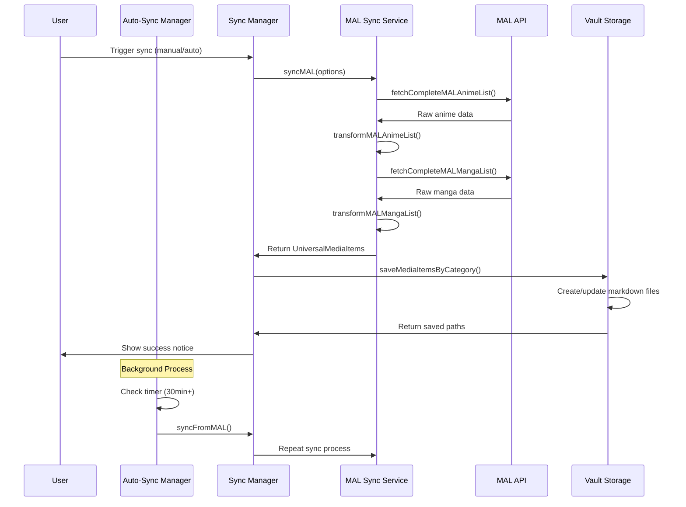

# Sync Mechanism Documentation for Cassette Plugin

## Overview

The Cassette plugin implements a multi-layered synchronization system that fetches media data from MyAnimeList and saves it to your Obsidian vault. The sync mechanism consists of three main components:

1. **MAL Sync Service**: Fetches and transforms raw data from MAL API
2. **Sync Manager**: Orchestrates syncing and saving to vault
3. **Auto-Sync Manager**: Handles automated background syncing



## Contributor Setup

### Prerequisites

1. **Authenticated MAL Connection**: Sync requires valid MAL authentication tokens
    
    - See [OAuth 2.0 Authentication Flow](./oauth-2.0-authentication-flow-for-myanimelist-in-obsidian.md) for setup
    - Sync functions will fail gracefully if not authenticated
2. **Vault Configuration**: Configure sync folders in plugin settings
    
    - Default anime folder: `Media/Anime/`
    - Default manga folder: `Media/Manga/`
    - Folders are auto-created if missing
3. **Testing Recommendations**:
    
    - Use a test vault to avoid polluting production data
    - Test with small anime/manga lists first (use status filters)
    - Enable debug logging: `createDebugLogger(plugin, 'MAL Sync')`

### Testing Checklist

Before committing sync changes:

- ✅ Full sync (anime + manga)
- ✅ Category-specific sync (anime only, manga only)
- ✅ Status filter sync (e.g., only "watching" anime)
- ✅ Auto-sync on load (1-minute delay)
- ✅ Scheduled sync (30+ minute intervals)
- ✅ Network failure handling (simulate API errors)
- ✅ Rate limiting behavior (verify throttling)
- ✅ Unauthenticated state (verify graceful failure)

## Architecture

### File Structure

```
src/sync/
├── index.ts              # Public API exports
├── sync-manager.ts       # High-level sync orchestration
├── mal-sync-service.ts   # MAL-specific sync logic
└── auto-sync.ts          # Automated background syncing
```

_All paths are relative to project root._

## Core Components

### 1. MAL Sync Service

**File:** `src/sync/mal-sync-service.ts`

The MAL Sync Service is the lowest-level component responsible for:

- Fetching raw data from MAL API
- Transforming it into `UniversalMediaItem` format
- Handling API errors and rate limiting

#### Sync Options

```typescript
export interface MALSyncOptions {
  syncAnime?: boolean;        // Enable anime sync (default: true)
  syncManga?: boolean;        // Enable manga sync (default: true)
  animeStatuses?: string[];   // Filter anime by status
  mangaStatuses?: string[];   // Filter manga by status
}
```

**Why separate flags?** Users may want to sync only anime or only manga to reduce API calls and vault clutter.

#### Main Sync Function

```typescript
export async function syncMAL(
  plugin: CassettePlugin,
  options: MALSyncOptions = DEFAULT_SYNC_OPTIONS
): Promise<{ items: UniversalMediaItem[]; result: SyncResult }>
```

**Process flow:**

1. **Authentication Check**
    
    ```typescript
    if (!isAuthenticated(plugin)) {
      throw new Error('Not authenticated with MyAnimeList');
    }
    ```
    
    Fails fast if tokens are invalid. See [[OAuth 2.0 Authentication Flow]] for token management.
    
2. **Fetch Anime** (if enabled)
    
    ```typescript
    if (options.syncAnime !== false) {
      const animeItems = await syncAnimeList(plugin, options.animeStatuses);
      allItems.push(...animeItems);
    }
    ```
    
3. **Fetch Manga** (if enabled)
    
    ```typescript
    if (options.syncManga !== false) {
      const mangaItems = await syncMangaList(plugin, options.mangaStatuses);
      allItems.push(...mangaItems);
    }
    ```
    
4. **Return Results**
    
    ```typescript
    return { 
      items: allItems,           // Transformed UniversalMediaItems
      result: syncResult         // Metadata (success, counts, errors)
    };
    ```
    

#### Status Filtering

**Anime Statuses:**

- `watching`
- `completed`
- `on_hold`
- `dropped`
- `plan_to_watch`

**Manga Statuses:**

- `reading`
- `completed`
- `on_hold`
- `dropped`
- `plan_to_read`

**Implementation:**

```typescript
async function syncAnimeList(
  plugin: CassettePlugin,
  statuses?: string[]
): Promise<UniversalMediaItem[]> {
  let rawItems: any[] = [];

  if (statuses && statuses.length > 0) {
    // Fetch multiple statuses in parallel (throttled)
    const animePromises = statuses.map(status => 
      fetchMALAnimeByStatus(plugin, status as 'watching' | 'completed' | ...)
    );
    
    const animeResults = await throttlePromises(animePromises, 2, 300);
    rawItems = animeResults.flat();
  } else {
    // Fetch entire list
    rawItems = await fetchCompleteMALAnimeList(plugin);
  }

  return transformMALAnimeList(plugin, rawItems);
}
```

**Why throttle?**

```typescript
await throttlePromises(animePromises, 2, 300);
```

- **Batch size: 2** - Only 2 concurrent requests at a time
- **Delay: 300ms** - 300ms pause between batches
- Prevents MAL API rate limiting (see [[OAuth 2.0 Authentication Flow#Rate Limiting]])

#### Error Handling

Each category (anime/manga) is synced independently. If anime sync fails, manga sync still proceeds:

```typescript
try {
  const animeItems = await syncAnimeList(plugin, options.animeStatuses);
  allItems.push(...animeItems);
} catch (error) {
  errors.push(`Failed to sync anime: ${error.message}`);
  new Notice(`❌ ${error.message}`, 5000);
  // Continue to manga sync
}
```

This ensures partial success—if anime fails but manga succeeds, you still get manga data.

### 2. Sync Manager

**File:** `src/sync/sync-manager.ts`

The Sync Manager is a high-level orchestrator that:

- Calls MAL Sync Service
- Saves results to vault storage
- Provides convenience methods for common operations

#### Core Method: `syncFromMAL()`

```typescript
async syncFromMAL(options: CompleteSyncOptions = {}): Promise<{
  items: UniversalMediaItem[];
  result: SyncResult;
  savedPaths?: { anime: string[]; manga: string[] };
}>
```

**Complete sync options:**

```typescript
export interface CompleteSyncOptions extends MALSyncOptions {
  saveToVault?: boolean;      // Auto-save to vault (default: true)
  storageConfig?: StorageConfig;  // Override folder paths
}
```

**Process flow:**

1. **Fetch from MAL**
    
    ```typescript
    const { items, result } = await syncMAL(this.plugin, options);
    ```
    
2. **Save to Vault** (if enabled)
    
    ```typescript
    if (options.saveToVault !== false && items.length > 0) {
      const storageConfig = options.storageConfig || this.getStorageConfig();
      
      savedPaths = await saveMediaItemsByCategory(
        this.plugin,
        items,
        storageConfig
      );
    }
    ```
    
3. **Return Combined Results**
    
    ```typescript
    return { items, result, savedPaths };
    ```
    

**Why separate save step?** You might want to:

- Preview data before saving
- Transform items further
- Save to custom locations
- Skip vault operations for testing

#### Storage Configuration

```typescript
private getStorageConfig(): StorageConfig {
  return {
    animeFolder: this.plugin.settings.animeFolder,  // e.g., "Media/Anime/"
    mangaFolder: this.plugin.settings.mangaFolder,  // e.g., "Media/Manga/"
    createFolders: true,                            // Auto-create if missing
    propertyMapping: this.plugin.settings.useCustomPropertyMapping 
      ? this.plugin.settings.propertyMapping 
      : undefined,  // Custom frontmatter field names
  };
}
```

**Property mapping** allows users to customize frontmatter field names:

```yaml
# Default
---
title: "Cowboy Bebop"
mal_id: 1
status: completed
---

# Custom mapping
---
title: "Cowboy Bebop"
myanimelist_id: 1
watch_status: completed
---
```

#### Convenience Methods

**Quick sync by category:**

```typescript
await syncManager.syncAnime();    // Anime only
await syncManager.syncManga();    // Manga only
```

**Sync by status:**

```typescript
// Only "watching" anime
await syncManager.syncByStatus(MediaCategory.ANIME, 'watching');

// Only "plan_to_read" manga
await syncManager.syncByStatus(MediaCategory.MANGA, 'plan_to_read');
```

These are wrappers around `syncFromMAL()` with pre-configured options for common use cases.

### 3. Auto-Sync Manager

**File:** `src/sync/auto-sync.ts`

The Auto-Sync Manager handles automated background syncing with two independent timers:

1. **Sync on Load**: One-time sync 1 minute after plugin loads
2. **Scheduled Sync**: Recurring sync at user-configured intervals (minimum 30 minutes)

#### Why Two Timers?

**Sync on Load** (1-minute delay):

- Ensures fresh data when opening Obsidian
- Short delay prevents blocking plugin initialization
- One-time only (doesn't repeat)

**Scheduled Sync** (30+ minutes):

- Keeps data fresh during long sessions
- Repeating timer
- Minimum 30 minutes prevents excessive API calls

#### Timer Management

```typescript
export class AutoSyncManager {
  private syncOnLoadTimer: NodeJS.Timeout | null = null;
  private scheduledSyncTimer: NodeJS.Timeout | null = null;
  
  start(): void {
    if (this.plugin.settings.syncOnLoad) {
      this.startSyncOnLoad();
    }
    
    if (this.plugin.settings.scheduledSync) {
      this.startScheduledSync();
    }
  }
}
```

**Independent timers:** Each timer checks authentication and settings independently. Disabling one doesn't affect the other.

#### Sync on Load Implementation

```typescript
private startSyncOnLoad(): void {
  this.clearSyncOnLoadTimer();

  // Pre-check authentication
  if (!this.isAuthenticated()) {
    this.debug.log('[Sync on Load] Skipped: Not authenticated');
    return;
  }

  this.syncOnLoadTimer = setTimeout(async () => {
    // Double-check at execution time
    if (!this.isAuthenticated()) {
      this.debug.log('[Sync on Load] Aborted: Not authenticated');
      return;
    }

    await this.plugin.syncManager.syncFromMAL();
  }, SYNC_ON_LOAD_DELAY);  // 1 minute = 60,000ms
}
```

**Why double-check authentication?** User might logout between timer start (plugin load) and timer execution (1 minute later). The double-check prevents unnecessary API calls.

#### Scheduled Sync Implementation

```typescript
private startScheduledSync(): void {
  this.clearScheduledSyncTimer();

  if (!this.isAuthenticated()) {
    return;
  }

  // Validate minimum interval (30 minutes)
  const intervalMinutes = Math.max(
    this.plugin.settings.scheduledSyncInterval,
    MIN_SCHEDULED_INTERVAL
  );
  const intervalMs = intervalMinutes * 60 * 1000;

  const runSync = async () => {
    if (!this.isAuthenticated()) {
      this.debug.log('[Scheduled Sync] Aborted: Not authenticated');
      return;
    }

    await this.plugin.syncManager.syncFromMAL();

    // Schedule next sync if still enabled
    if (this.plugin.settings.scheduledSync && this.isAuthenticated()) {
      this.scheduledSyncTimer = setTimeout(runSync, intervalMs);
    }
  };

  this.scheduledSyncTimer = setTimeout(runSync, intervalMs);
}
```

**Recursive scheduling:** After each sync completes, the timer schedules itself again. This is safer than `setInterval()` because it ensures syncs don't overlap if one takes longer than the interval.

**30-minute minimum:**

```typescript
const intervalMinutes = Math.max(
  this.plugin.settings.scheduledSyncInterval,
  MIN_SCHEDULED_INTERVAL  // 30
);
```

Prevents users from accidentally hammering the MAL API with overly frequent requests.

#### Authentication Checking

```typescript
private isAuthenticated(): boolean {
  return !!(
    this.plugin.settings.malAuthenticated && 
    this.plugin.settings.malAccessToken
  );
}
```

Simple flag + token check. Full token validation (expiry, refresh) is handled by the MAL API layer (see [[OAuth 2.0 Authentication Flow#Token Management]]).

#### Cleanup

```typescript
stop(): void {
  this.clearSyncOnLoadTimer();
  this.clearScheduledSyncTimer();
}

private clearSyncOnLoadTimer(): void {
  if (this.syncOnLoadTimer) {
    clearTimeout(this.syncOnLoadTimer);
    this.syncOnLoadTimer = null;
  }
}
```

Always clear timers when:

- Plugin unloads
- User disables auto-sync
- User logs out

Prevents orphaned timers that continue running after they should stop.

## Data Flow

### UniversalMediaItem Format

The sync system uses `UniversalMediaItem` as a normalized format that works across different APIs (MAL, AniList, etc.):

```typescript
interface UniversalMediaItem {
  id: string;                    // Unique identifier
  title: string;                 // Primary title
  category: MediaCategory;       // ANIME or MANGA
  status: string;                // User's list status
  score?: number;                // User's rating (0-10)
  progress?: number;             // Episodes/chapters consumed
  
  // Media metadata
  malId?: number;
  synopsis?: string;
  genres?: string[];
  meanScore?: number;            // Community rating
  
  // ... many more fields
}
```

**Why universal format?** Allows the plugin to support multiple APIs without rewriting storage/UI logic. Each API has its own transformer (e.g., `transformMALAnimeList()`) that converts API-specific data to this format.

### Transformation Pipeline

```typescript
// 1. Raw MAL API response
const rawItems = await fetchCompleteMALAnimeList(plugin);

// 2. Transform to universal format
const items = transformMALAnimeList(plugin, rawItems);

// 3. Save to vault
await saveMediaItemsByCategory(plugin, items, config);
```

**Transformers** (in `src/transformers/`):

- `transformMALAnimeList()`: MAL anime → UniversalMediaItem[]
- `transformMALMangaList()`: MAL manga → UniversalMediaItem[]
- Handle missing fields, format conversions, default values

### Storage to Vault

**File:** `src/storage/` (not shown in documents)

```typescript
await saveMediaItemsByCategory(plugin, items, {
  animeFolder: 'Media/Anime/',
  mangaFolder: 'Media/Manga/',
  createFolders: true
});
```

**Storage behavior:**

- Creates one markdown file per item
- Filename: `{title}.md` (sanitized for filesystem)
- Frontmatter: Item metadata as YAML
- Content: Synopsis or empty
- Updates existing files (preserves user edits to content)

**Example output:**

```markdown
---
title: "Cowboy Bebop"
mal_id: 1
category: anime
status: completed
score: 10
episodes_watched: 26
total_episodes: 26
genres:
  - Action
  - Sci-Fi
---

# Cowboy Bebop

Spike Spiegel is a bounty hunter...
```

## Error Handling Strategy

### Layered Error Handling

Each layer handles errors differently:

**1. API Layer** (`src/api/mal/`):

- Retries on rate limits (429) with exponential backoff
- Throws on auth failures
- See [[OAuth 2.0 Authentication Flow#Rate Limiting]]

**2. Sync Service Layer** (`mal-sync-service.ts`):

- Catches API errors
- Shows user-facing notices
- Continues to next category (anime failure doesn't stop manga)
- Returns partial results

**3. Manager Layer** (`sync-manager.ts`):

- Catches storage errors
- Shows separate notices for sync vs. save failures
- Distinguishes "synced but not saved" vs. "sync failed"

**4. Auto-Sync Layer** (`auto-sync.ts`):

- Silently logs errors (background process)
- Doesn't show notices (would spam user)
- Continues scheduling next sync

### Error Examples

**Authentication expired:**

```typescript
// API layer throws
throw new Error('MAL authentication expired. Please re-authenticate.');

// Sync service catches and shows notice
new Notice('❌ Not authenticated with MyAnimeList', 5000);
```

**Rate limit hit:**

```typescript
// API layer retries automatically with backoff
// User sees nothing unless max retries exceeded
new Notice('❌ MAL API rate limit exceeded. Try again in a few minutes.', 5000);
```

**Network failure:**

```typescript
// API layer throws after max retries
// Sync service catches
new Notice('❌ Failed to sync anime: Network request failed', 5000);
// Continues to manga sync
```

**Storage failure:**

```typescript
// Sync succeeded, storage failed
new Notice('⚠️ Synced but failed to save: Permission denied', 5000);
// User can retry save or manually trigger sync
```

## Performance Considerations

### Rate Limiting

**Throttled requests:**

```typescript
await throttlePromises(animePromises, 2, 300);
```

- **Batch size: 2** concurrent requests
- **300ms delay** between batches
- For 5 status filters: 2 concurrent, pause, 2 concurrent, pause, 1
- Total time: ~600ms for 5 requests (vs. instant but rate-limited)

**Why not higher concurrency?** MAL's rate limits are strict. Conservative throttling prevents 429 errors and ensures reliable syncs.

### Pagination

```typescript
// Fetches ALL pages automatically
const rawItems = await fetchCompleteMALAnimeList(plugin);
```

The API layer handles pagination internally (see `src/api/mal/mal-api-service.ts`):

- Fetches 100 items per request (MAL's max)
- Continues until no more pages
- Safety limit: 10,000 items (prevents infinite loops)

**For large lists (1000+ items):**

- Expect 10+ API requests
- Takes 3-5 seconds with throttling
- All or nothing—can't partially sync

### Memory Usage

**Large lists:**

- 1000 anime = ~5MB in memory (raw + transformed)
- 1000 manga = ~3MB in memory
- Total peak: ~10MB for 2000 items

**Vault writes:**

- Sequential writes (not batched)
- ~1ms per file on SSD
- 1000 items = ~1 second write time

**Optimization opportunity:** Batch vault writes in future versions for faster saves.

## Integration Points

### Plugin Settings

Required for sync:

```typescript
interface PluginSettings {
  // Authentication (required)
  malAuthenticated: boolean;
  malAccessToken: string;
  
  // Storage configuration
  animeFolder: string;           // Default: "Media/Anime/"
  mangaFolder: string;           // Default: "Media/Manga/"
  
  // Auto-sync settings
  syncOnLoad: boolean;           // Default: false
  scheduledSync: boolean;        // Default: false
  scheduledSyncInterval: number; // Minutes (default: 60)
  
  // Property mapping
  useCustomPropertyMapping: boolean;
  propertyMapping?: Record<string, string>;
}
```

### Plugin Initialization

In `main.ts`:

```typescript
async onload() {
  // Create sync manager
  this.syncManager = createSyncManager(this);
  
  // Start auto-sync if configured
  this.autoSyncManager = createAutoSyncManager(this);
}

async onunload() {
  // Stop auto-sync timers
  this.autoSyncManager?.stop();
}
```

### Manual Sync Triggers

**Command palette:**

```typescript
this.addCommand({
  id: 'sync-mal-full',
  name: 'Sync all from MyAnimeList',
  callback: async () => {
    await this.syncManager.syncFromMAL();
  }
});

this.addCommand({
  id: 'sync-mal-anime',
  name: 'Sync anime from MyAnimeList',
  callback: async () => {
    await this.syncManager.syncAnime();
  }
});
```

**Settings UI button:**

```typescript
new Setting(containerEl)
  .setName('Sync now')
  .setDesc('Manually trigger a full sync')
  .addButton(button => button
    .setButtonText('Sync from MAL')
    .onClick(async () => {
      await this.plugin.syncManager.syncFromMAL();
    }));
```

## Usage Examples

### Basic Sync

**File:** `src/sync/index.ts` (barrel export)

```typescript
import { createSyncManager } from 'src/sync';

// Create manager
const syncManager = createSyncManager(plugin);

// Full sync (anime + manga, save to vault)
const { items, result } = await syncManager.syncFromMAL();

console.log(`Synced ${result.itemsSucceeded} items`);
```

### Category-Specific Sync

```typescript
// Anime only
const animeItems = await syncManager.syncAnime();

// Manga only
const mangaItems = await syncManager.syncManga();
```

### Status Filter Sync

```typescript
import { MediaCategory } from 'src/models';

// Only "watching" anime
await syncManager.syncByStatus(
  MediaCategory.ANIME, 
  'watching'
);

// Only "plan_to_read" manga
await syncManager.syncByStatus(
  MediaCategory.MANGA,
  'plan_to_read'
);
```

### Advanced Options

```typescript
// Custom storage paths
await syncManager.syncFromMAL({
  syncAnime: true,
  syncManga: false,
  saveToVault: true,
  storageConfig: {
    animeFolder: 'My Custom Folder/',
    mangaFolder: 'Another Folder/',
    createFolders: true
  }
});

// Fetch without saving (preview mode)
const { items } = await syncManager.syncFromMAL({
  saveToVault: false
});
console.log('Preview:', items.length, 'items');
```

### Auto-Sync Setup

```typescript
import { createAutoSyncManager } from 'src/sync';

// Enable in settings
plugin.settings.syncOnLoad = true;
plugin.settings.scheduledSync = true;
plugin.settings.scheduledSyncInterval = 60; // Every hour

// Start auto-sync
const autoSync = createAutoSyncManager(plugin);

// Stop auto-sync (on logout, settings change, or plugin unload)
autoSync.stop();
```

## Debugging Tips

### Enable Debug Logging

All sync components support debug logging:

```typescript
const debug = createDebugLogger(plugin, 'MAL Sync');
debug.log('[MAL Sync] Starting sync...', options);
```

**Enable in plugin settings** → Shows detailed logs in DevTools console.

**Log categories:**

- `MAL Sync` - Sync service operations
- `Sync Manager` - High-level orchestration
- `Auto Sync` - Timer events and triggers
- `MAL API` - API requests and responses (from API layer)

### Common Issues

**"Not authenticated with MyAnimeList":**

- Token expired or invalid
- Solution: Re-authenticate via [OAuth 2.0 Authentication Flow](./oauth-2.0-authentication-flow-for-myanimelist-in-obsidian.md)

**Auto-sync not running:**

- Check `plugin.settings.syncOnLoad` and `scheduledSync` flags
- Verify authentication: `isAuthenticated()` must return true
- Check console for "[Auto Sync] Skipped" messages

**Partial sync (anime succeeded, manga failed):**

- Check network logs for manga API requests
- Verify manga list exists on MAL (empty lists return 0 items, not errors)
- Review error messages in notices

**Files not saving to vault:**

- Check folder paths in settings (must end with `/`)
- Verify write permissions on vault
- Look for "[Sync Manager] Failed to save to vault" in console

**Rate limit errors:**

- Reduce sync frequency (increase scheduled interval)
- Avoid manual syncs during auto-sync
- MAL's rate limits reset after ~1 minute

**Empty sync results:**

- Verify your MAL account has anime/manga in your list
- Check if status filters are too restrictive
- Review MAL API responses in network logs (should return `data` array)

### Testing Scenarios

**Simulate network failure:**

```typescript
// In mal-api-service.ts, temporarily add:
throw new Error('Network request failed');
```

Verify sync shows error notice and doesn't crash.

**Simulate rate limit:**

```typescript
// Return 429 response
{ status: 429, text: 'Too Many Requests' }
```

Verify automatic retry with backoff.

**Test with empty list:** Create a fresh MAL account with no anime/manga. Verify sync completes without errors and returns 0 items.

**Test with large list:** Use an account with 500+ items. Verify pagination works and all items are fetched.

## Future Improvements

### Potential Optimizations

1. **Incremental Sync**: Only fetch items updated since last sync
    
    - Requires storing `last_synced_at` timestamp
    - Use MAL API's `updated_at` field for filtering
    - Would reduce API calls by 90%+ for regular syncs
2. **Batch Vault Writes**: Write multiple files in parallel
    
    - Currently: Sequential writes
    - Proposed: Batch in groups of 10-20
    - 10x faster saves for large lists
3. **Diff-Based Updates**: Only update changed files
    
    - Compare existing frontmatter with new data
    - Skip unchanged items
    - Reduces unnecessary disk I/O
4. **Progress Indicators**: Show sync progress in real-time
    
    - "Syncing anime: 50/200..."
    - Requires streaming results instead of batch
5. **Selective Category Sync UI**: Checkboxes for each category
    
    - Currently: All-or-nothing in settings
    - Proposed: Per-sync category selection

### Known Limitations

1. **No conflict resolution**: If user edits frontmatter, sync overwrites it
    
    - Mitigation: Only sync updates metadata, preserves content
    - Future: Merge strategies or skip modified files
2. **No undo**: Sync is destructive (overwrites files)
    
    - Mitigation: Obsidian's built-in file history
    - Future: Sync history/rollback feature
3. **No real-time sync**: Updates only on manual/scheduled sync
    
    - MAL doesn't provide webhooks
    - Future: Poll for changes more frequently
4. **Memory-intensive**: Loads entire list into memory
    
    - Problematic for 5000+ item lists
    - Future: Stream processing

## References

- [OAuth 2.0 Authentication Flow](./oauth-2.0-authentication-flow-for-myanimelist-in-obsidian.md) - Authentication and token management
- [MAL API Documentation](https://myanimelist.net/apiconfig/references/api/v2) - Official API reference
- `src/api/mal/mal-api-service.ts` - API layer implementation
- `src/transformers/` - Data transformation logic
- `src/storage/` - Vault storage implementation

---
